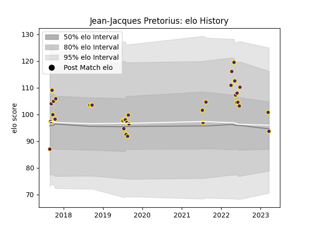

---  
layout: page  
title: Jean-Jacques Pretorius  
date: 2023-03-12 11:34:36.735294  
categories: player  
---
# Jean-Jacques Pretorius

## Positions: FL

## Current elo: 101.0

## Current Percentile: 85.0

# Elo History

# Match History

| Team     |   Appearances |   Win Rate |
|:---------|--------------:|-----------:|
| Griffons |            34 |       0.75 |

| Opponent               |   Matches |   Win Rate |
|:-----------------------|----------:|-----------:|
| Eastern Province Kings |         6 |   1        |
| Leopards               |         6 |   0.666667 |
| Boland Cavaliers       |         5 |   0.7      |
| Valke                  |         5 |   0.7      |
| SWD Eagles             |         3 |   0.833333 |
| Border Bulldogs        |         2 |   1        |
| Jaguares XV            |         2 |   0        |
| Black Lion             |         1 |   1        |
| Namibia Welwitchias    |         1 |   1        |
| Natal Sharks           |         1 |   0        |
| Tusker Simba           |         1 |   1        |
| Zimbabwe Goshawks      |         1 |   1        |