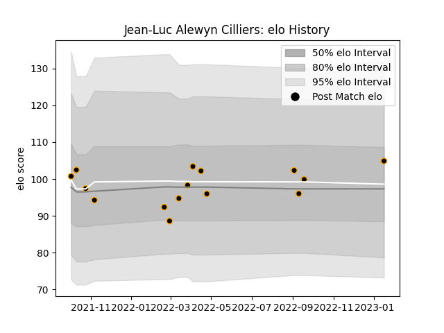

---  
layout: page  
title: Jean-Luc Alewyn Cilliers  
date: 2023-01-17 11:31:22.370889  
categories: player  
---
# Jean-Luc Alewyn Cilliers

## Positions: FH, C

## Current elo: 105.0

## Current Percentile: 56.0

# Elo History

# Match History

| Team     |   Appearances |   Win Rate |
|:---------|--------------:|-----------:|
| Chambery |            15 |   0.466667 |

| Opponent                   |   Matches |   Win Rate |
|:---------------------------|----------:|-----------:|
| Blagnac                    |         2 |        0.5 |
| Bourgoin-Jallieu           |         2 |        0.5 |
| Tarbes                     |         2 |        0.5 |
| US Bressane                |         2 |        0.5 |
| Albi                       |         1 |        0   |
| Dax                        |         1 |        0   |
| Dijon                      |         1 |        1   |
| Massy                      |         1 |        0   |
| Nice                       |         1 |        1   |
| Soyaux-Angouleme           |         1 |        1   |
| Valence Romans Drome Rugby |         1 |        0   |