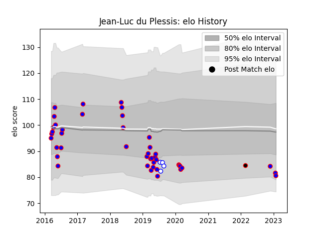

---  
layout: page  
title: Jean-Luc du Plessis  
date: 2023-03-21 18:08:15.387324  
categories: player  
---
# Jean-Luc du Plessis

Last updated: 2023-03-21
## Positions: FH

## Current elo: 87.0

## Current Percentile: 24.0

# Elo History

# Match History

| Team             |   Appearances |   Win Rate |
|:-----------------|--------------:|-----------:|
| Stormers         |            41 |   0.560976 |
| Western Province |             4 |   0.5      |
| Mie Honda Heat   |             1 |   1        |

| Opponent                 |   Matches |   Win Rate |
|:-------------------------|----------:|-----------:|
| Bulls                    |         6 |   0.666667 |
| Jaguares                 |         6 |   0.666667 |
| Lions                    |         5 |   0.4      |
| Sunwolves                |         4 |   0.625    |
| Sharks                   |         4 |   0.25     |
| Queensland Reds          |         2 |   0.5      |
| Blues                    |         2 |   0        |
| Melbourne Rebels         |         2 |   1        |
| New South Wales Waratahs |         1 |   0        |
| Southern Kings           |         1 |   1        |
| Skyactivs Hiroshima      |         1 |   1        |
| Scarlets                 |         1 |   1        |
| Pumas                    |         1 |   1        |
| Blue Bulls               |         1 |   1        |
| Natal Sharks             |         1 |   0        |
| Hurricanes               |         1 |   0        |
| Highlanders              |         1 |   1        |
| Free State Cheetahs      |         1 |   0        |
| Crusaders                |         1 |   0.5      |
| Chiefs                   |         1 |   0        |
| Cheetahs                 |         1 |   1        |
| Brumbies                 |         1 |   1        |
| Western Force            |         1 |   1        |