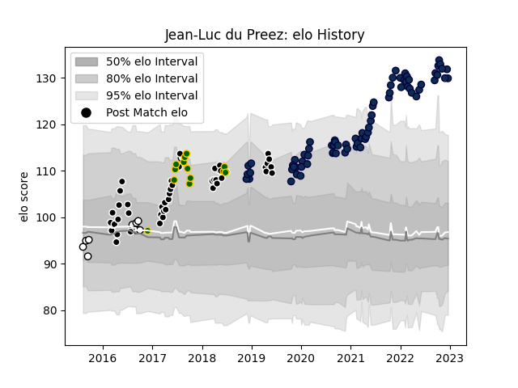

---  
layout: page  
title: Jean-Luc du Preez  
date: 2023-03-21 18:07:30.200712  
categories: player  
---
# Jean-Luc du Preez

Last updated: 2023-03-21
## Positions: FL, L

## Country: South Africa

## Current elo: 96.0

## Current Percentile: 64.0

# Elo History

# Match History

| Team         |   Appearances |   Win Rate |
|:-------------|--------------:|-----------:|
| Sale Sharks  |            94 |   0.601064 |
| Sharks       |            45 |   0.522222 |
| Natal Sharks |            17 |   0.529412 |
| South Africa |            13 |   0.615385 |

| Opponent                 |   Matches |   Win Rate |
|:-------------------------|----------:|-----------:|
| Bristol Rugby            |        10 |   0.7      |
| Northampton Saints       |         8 |   0.75     |
| Bath Rugby               |         8 |   0.5      |
| Harlequins               |         8 |   0.625    |
| Gloucester Rugby         |         7 |   0.714286 |
| Exeter Chiefs            |         7 |   0.285714 |
| Leicester Tigers         |         7 |   0.857143 |
| Lions                    |         7 |   0.285714 |
| London Irish             |         7 |   0.785714 |
| Jaguares                 |         5 |   0.6      |
| Wasps                    |         5 |   1        |
| Pumas                    |         4 |   0.75     |
| Saracens                 |         4 |   0.5      |
| Southern Kings           |         4 |   0.75     |
| Hurricanes               |         4 |   0.25     |
| Western Province         |         4 |   0.25     |
| Newcastle Falcons        |         3 |   0.333333 |
| Stormers                 |         3 |   1        |
| La Rochelle              |         3 |   0.333333 |
| Golden Lions             |         3 |   0        |
| Worcester Warriors       |         3 |   0.666667 |
| Chiefs                   |         3 |   0.333333 |
| France                   |         3 |   1        |
| England                  |         3 |   0.666667 |
| Cheetahs                 |         2 |   1        |
| Blue Bulls               |         2 |   1        |
| Blues                    |         2 |   0.5      |
| Ulster                   |         2 |   0.5      |
| Bordeaux Begles          |         2 |   0.5      |
| Stade Toulousain         |         2 |   0        |
| Brumbies                 |         2 |   0.5      |
| Bulls                    |         2 |   0        |
| Queensland Reds          |         2 |   0        |
| Ospreys                  |         2 |   1        |
| Argentina                |         2 |   1        |
| New South Wales Waratahs |         2 |   1        |
| Highlanders              |         2 |   1        |
| Crusaders                |         2 |   0.25     |
| Eastern Province Kings   |         2 |   1        |
| New Zealand              |         2 |   0        |
| Australia                |         2 |   0.5      |
| Clermont Auvergne        |         1 |   0        |
| Toulon                   |         1 |   0        |
| Free State Cheetahs      |         1 |   0        |
| Western Force            |         1 |   1        |
| Wales                    |         1 |   0        |
| Edinburgh                |         1 |   0        |
| Sunwolves                |         1 |   1        |
| Scarlets                 |         1 |   1        |
| Melbourne Rebels         |         1 |   0        |
| Racing 92                |         1 |   0        |
| Griquas                  |         1 |   1        |
| Glasgow Warriors         |         1 |   0        |