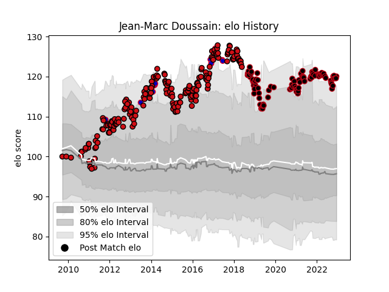

---  
layout: page  
title: Jean-Marc Doussain  
date: 2022-12-14 11:11:46.136935  
categories: player  
---
# Jean-Marc Doussain

## Positions: SH, FH

## Country: France

## Current elo: 120.0

## Current Percentile: 95.0

# Elo History

# Match History

| Team             |   Appearances |   Win Rate |
|:-----------------|--------------:|-----------:|
| Stade Toulousain |           196 |   0.609694 |
| Lyon             |            91 |   0.549451 |
| France           |            17 |   0.470588 |

| Opponent             |   Matches |   Win Rate |
|:---------------------|----------:|-----------:|
| Montpellier Herault  |        25 |   0.64     |
| Toulon               |        23 |   0.521739 |
| Clermont Auvergne    |        19 |   0.421053 |
| Bordeaux Begles      |        18 |   0.583333 |
| Castres Olympique    |        17 |   0.470588 |
| Stade Francais Paris |        17 |   0.823529 |
| Racing 92            |        16 |   0.5625   |
| Brive                |        13 |   0.730769 |
| La Rochelle          |        12 |   0.416667 |
| Bayonne              |        11 |   0.636364 |
| Pau                  |        11 |   0.681818 |
| Agen                 |        11 |   0.818182 |
| Lyon                 |        10 |   0.7      |
| Biarritz Olympique   |         8 |   1        |
| Grenoble             |         8 |   0.625    |
| Stade Toulousain     |         7 |   0.642857 |
| Saracens             |         6 |   0.333333 |
| Perpignan            |         6 |   0.666667 |
| Connacht             |         5 |   0.6      |
| Glasgow Warriors     |         5 |   0.6      |
| Oyonnax              |         5 |   0.5      |
| Cardiff Blues        |         4 |   0        |
| New Zealand          |         3 |   0        |
| Wasps                |         3 |   0.166667 |
| Zebre                |         3 |   1        |
| Leicester Tigers     |         2 |   0.5      |
| South Africa         |         2 |   0        |
| Mont-de-Marsan       |         2 |   1        |
| Italy                |         2 |   1        |
| Munster              |         2 |   0        |
| Ireland              |         2 |   0.5      |
| Ospreys              |         2 |   0.5      |
| Harlequins           |         2 |   0.5      |
| Wales                |         2 |   0.5      |
| England              |         2 |   0.5      |
| Ulster               |         2 |   0        |
| Benetton Treviso     |         2 |   1        |
| Bourgoin-Jallieu     |         2 |   1        |
| Scotland             |         2 |   1        |
| Bath Rugby           |         1 |   0        |
| Bulls                |         1 |   0        |
| Leinster             |         1 |   0        |
| Dragons              |         1 |   1        |
| Samoa                |         1 |   1        |
| Australia            |         1 |   0        |
| Edinburgh            |         1 |   0        |
| Gloucester Rugby     |         1 |   0        |
| Montauban            |         1 |   1        |
| Sale Sharks          |         1 |   0.5      |