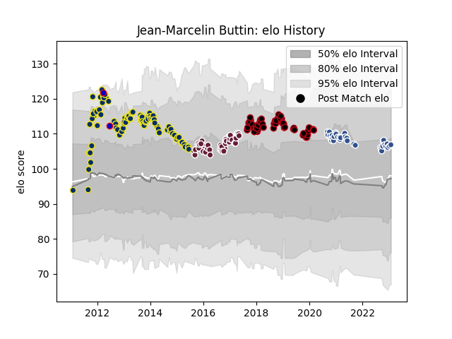

---  
layout: page  
title: Jean-Marcelin Buttin  
date: 2022-12-18 16:24:55.727100  
categories: player  
---
# Jean-Marcelin Buttin

## Positions: FB

## Country: France

## Current elo: 96.0

## Current Percentile: 59.0

# Elo History

# Match History

| Team              |   Appearances |   Win Rate |
|:------------------|--------------:|-----------:|
| Clermont Auvergne |            77 |   0.655844 |
| Lyon              |            50 |   0.5      |
| Bordeaux Begles   |            42 |   0.47619  |
| Agen              |            32 |   0.125    |
| France            |             2 |   0        |

| Opponent             |   Matches |   Win Rate |
|:---------------------|----------:|-----------:|
| Racing 92            |        16 |   0.5625   |
| Stade Toulousain     |        13 |   0.461538 |
| Toulon               |        11 |   0.227273 |
| Bayonne              |        11 |   0.681818 |
| Brive                |        11 |   0.727273 |
| Clermont Auvergne    |        11 |   0.181818 |
| Stade Francais Paris |        10 |   0.5      |
| Bordeaux Begles      |        10 |   0.6      |
| Montpellier Herault  |        10 |   0.5      |
| Pau                  |         8 |   0.625    |
| Castres Olympique    |         8 |   0.125    |
| Agen                 |         7 |   1        |
| La Rochelle          |         7 |   0.285714 |
| Grenoble             |         6 |   0.833333 |
| Lyon                 |         6 |   0.25     |
| Biarritz Olympique   |         6 |   0.666667 |
| Oyonnax              |         5 |   0.4      |
| Mont-de-Marsan       |         4 |   0.75     |
| Perpignan            |         4 |   0.75     |
| Exeter Chiefs        |         4 |   0.75     |
| Saracens             |         4 |   0.5      |
| Cardiff Blues        |         3 |   0        |
| Leinster             |         3 |   0        |
| Benetton Treviso     |         2 |   0.5      |
| Northampton Saints   |         2 |   0        |
| Ospreys              |         2 |   0.5      |
| Ulster               |         2 |   0.5      |
| Beziers              |         2 |   0        |
| Soyaux-Angouleme     |         1 |   0        |
| Sale Sharks          |         1 |   0        |
| Scarlets             |         1 |   1        |
| Aurillac             |         1 |   1        |
| Argentina            |         1 |   0        |
| Glasgow Warriors     |         1 |   0        |
| Rouen                |         1 |   1        |
| Nevers               |         1 |   0        |
| Munster              |         1 |   1        |
| Montauban            |         1 |   0        |
| Aironi               |         1 |   1        |
| Leicester Tigers     |         1 |   1        |
| Colomiers            |         1 |   0        |
| Harlequins           |         1 |   1        |
| Wales                |         1 |   0        |