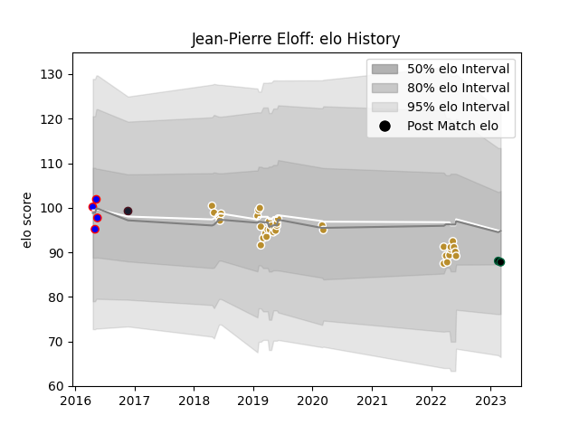

---  
layout: page  
title: Jean-Pierre Eloff  
date: 2023-03-21 18:32:03.573703  
categories: player  
---
# Jean-Pierre Eloff

Last updated: 2023-03-21
## Positions: FB, FH

## Country: United States of America

## Current elo: 86.0

## Current Percentile: 22.0

# Elo History

# Match History

| Team                     |   Appearances |   Win Rate |
|:-------------------------|--------------:|-----------:|
| NOLA Gold                |            36 |   0.361111 |
| Chicago Hounds           |             4 |   0.25     |
| Ohio                     |             4 |   0.5      |
| United States of America |             1 |   0        |

| Opponent               |   Matches |   Win Rate |
|:-----------------------|----------:|-----------:|
| San Diego Legion       |         5 |   0        |
| Utah Warriors          |         4 |   0.75     |
| Rugby New York         |         4 |   0        |
| R.U. New York          |         4 |   0        |
| New England Free Jacks |         3 |   0.333333 |
| Toronto Arrows         |         3 |   0.666667 |
| Austin Elite Rugby     |         3 |   0.666667 |
| Houston SaberCats      |         3 |   0.666667 |
| Glendale Raptors       |         3 |   0.333333 |
| Old Glory DC           |         2 |   0.5      |
| Seattle Seawolves      |         2 |   0.5      |
| Rugby ATL              |         2 |   0        |
| Austin Gilgronis       |         1 |   0        |
| Sacramento             |         1 |   1        |
| San Diego              |         1 |   0        |
| Denver                 |         1 |   0        |
| San Francisco          |         1 |   1        |
| Tonga                  |         1 |   0        |
| Dallas Jackals         |         1 |   1        |