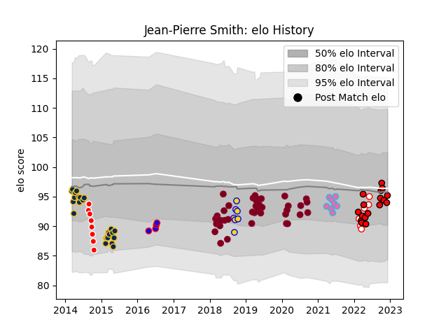

---  
layout: page  
title: Jean-Pierre Smith  
date: 2022-12-31 16:27:24.620538  
categories: player  
---
# Jean-Pierre Smith

## Positions: P

## Current elo: 90.0

## Current Percentile: 32.0

# Elo History

# Match History

| Team             |   Appearances |   Win Rate |
|:-----------------|--------------:|-----------:|
| Queensland Reds  |            39 |   0.397436 |
| Brumbies         |            24 |   0.583333 |
| Lions            |            20 |   0.625    |
| Western Province |             9 |   0.555556 |
| Canberra Vikings |             8 |   0.375    |
| L. A. Giltinis   |             8 |   0.875    |
| Brisbane City    |             7 |   0.571429 |
| Golden Lions     |             6 |   0.333333 |
| Stormers         |             4 |   1        |

| Opponent                 |   Matches |   Win Rate |
|:-------------------------|----------:|-----------:|
| Melbourne Rebels         |        11 |   0.5      |
| New South Wales Waratahs |         9 |   0.222222 |
| Stormers                 |         6 |   0.333333 |
| Brumbies                 |         6 |   0.333333 |
| Western Force            |         4 |   0.75     |
| Blues                    |         4 |   0.5      |
| Sunwolves                |         4 |   1        |
| Bulls                    |         4 |   0.25     |
| Sharks                   |         4 |   0.25     |
| Queensland Reds          |         4 |   1        |
| Griquas                  |         4 |   0.5      |
| Lions                    |         3 |   0.666667 |
| Free State Cheetahs      |         3 |   0        |
| Natal Sharks             |         3 |   0.666667 |
| Chiefs                   |         3 |   0.333333 |
| Dragons                  |         3 |   0.833333 |
| Jaguares                 |         3 |   0.333333 |
| Ospreys                  |         2 |   1        |
| Queensland Country       |         2 |   1        |
| NSW Country Eagles       |         2 |   0.5      |
| Melbourne Rising         |         2 |   0.5      |
| Hurricanes               |         2 |   0.5      |
| Seattle Seawolves        |         2 |   1        |
| Austin Gilgronis         |         2 |   1        |
| Edinburgh                |         2 |   1        |
| Crusaders                |         2 |   0        |
| Highlanders              |         2 |   0.5      |
| Cardiff Blues            |         2 |   1        |
| Houston SaberCats        |         1 |   1        |
| Scarlets                 |         1 |   1        |
| Blue Bulls               |         1 |   0        |
| Utah Warriors            |         1 |   1        |
| Ulster                   |         1 |   0        |
| Sydney Stars             |         1 |   0.5      |
| Sydney Rays              |         1 |   1        |
| Boland Cavaliers         |         1 |   1        |
| Brisbane City            |         1 |   0        |
| Stade Francais Paris     |         1 |   1        |
| Southern Kings           |         1 |   1        |
| Canberra Vikings         |         1 |   0        |
| Rugby ATL                |         1 |   0        |
| San Diego Legion         |         1 |   1        |
| Cheetahs                 |         1 |   0        |
| Connacht                 |         1 |   0        |
| Pumas                    |         1 |   1        |
| Perth Spirit             |         1 |   0        |
| North Harbour Rays       |         1 |   0.5      |
| Fijian Drua              |         1 |   0        |
| Golden Lions             |         1 |   0        |
| Munster                  |         1 |   1        |
| Greater Sydney Rams      |         1 |   1        |
| Benetton Treviso         |         1 |   1        |
| Western Province         |         1 |   1        |