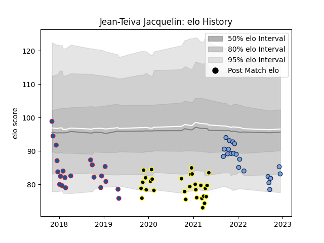

---  
layout: page  
title: Jean-Teiva Jacquelin  
date: 2022-12-18 16:21:59.994692  
categories: player  
---
# Jean-Teiva Jacquelin

## Positions: W

## Current elo: 83.0

## Current Percentile: 12.0

# Elo History

# Match History

| Team           |   Appearances |   Win Rate |
|:---------------|--------------:|-----------:|
| Mont-de-Marsan |            29 |   0.482759 |
| Grenoble       |            21 |   0.404762 |
| Bayonne        |            20 |   0.625    |

| Opponent                   |   Matches |   Win Rate |
|:---------------------------|----------:|-----------:|
| Aurillac                   |         6 |   1        |
| Beziers                    |         5 |   0.6      |
| Agen                       |         4 |   0.375    |
| Rouen                      |         4 |   1        |
| Provence Rugby             |         4 |   1        |
| Perpignan                  |         4 |   0.25     |
| Carcassonne                |         4 |   0.5      |
| Nevers                     |         4 |   0.25     |
| Soyaux-Angouleme           |         3 |   0.333333 |
| Oyonnax                    |         3 |   0        |
| Vannes                     |         3 |   0.666667 |
| Grenoble                   |         3 |   0.333333 |
| Biarritz Olympique         |         2 |   0.75     |
| Benetton Treviso           |         2 |   0        |
| Colomiers                  |         2 |   0        |
| Lyon                       |         2 |   0.5      |
| Valence Romans Drome Rugby |         1 |   0.5      |
| US Bressane                |         1 |   1        |
| Toulon                     |         1 |   0        |
| Stade Francais Paris       |         1 |   0        |
| Bayonne                    |         1 |   1        |
| Scarlets                   |         1 |   0        |
| Harlequins                 |         1 |   0        |
| Racing 92                  |         1 |   1        |
| Bordeaux Begles            |         1 |   1        |
| Castres Olympique          |         1 |   0        |
| Narbonne                   |         1 |   0.5      |
| Montpellier Herault        |         1 |   0        |
| Mont-de-Marsan             |         1 |   0        |
| Massy                      |         1 |   0        |
| Montauban                  |         1 |   1        |