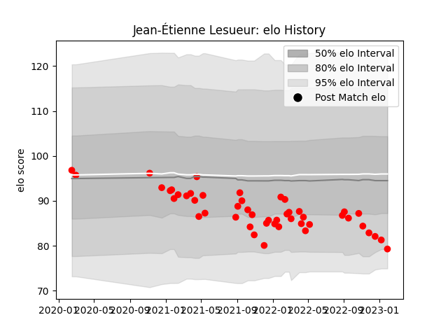

---  
layout: page  
title: Jean-Étienne Lesueur  
date: 2023-02-02 18:55:02.545062  
categories: player  
---
# Jean-Étienne Lesueur

## Positions: H

## Current elo: 79.0

## Current Percentile: 18.0

# Elo History

# Match History

| Team   |   Appearances |   Win Rate |
|:-------|--------------:|-----------:|
| Rouen  |            48 |   0.302083 |

| Opponent                   |   Matches |   Win Rate |
|:---------------------------|----------:|-----------:|
| Oyonnax                    |         5 |   0.4      |
| Carcassonne                |         4 |   0        |
| Colomiers                  |         4 |   0.25     |
| Grenoble                   |         4 |   0.5      |
| Beziers                    |         3 |   0.333333 |
| Mont-de-Marsan             |         3 |   0        |
| Aurillac                   |         3 |   0.333333 |
| Nevers                     |         3 |   0        |
| Agen                       |         2 |   0        |
| US Bressane                |         2 |   0.25     |
| Soyaux-Angouleme           |         2 |   1        |
| Provence Rugby             |         2 |   0.5      |
| Perpignan                  |         2 |   0.5      |
| Vannes                     |         2 |   0.5      |
| Narbonne                   |         2 |   0.5      |
| Massy                      |         1 |   1        |
| Biarritz Olympique         |         1 |   0        |
| Bayonne                    |         1 |   0        |
| Valence Romans Drome Rugby |         1 |   0        |
| Montauban                  |         1 |   0        |