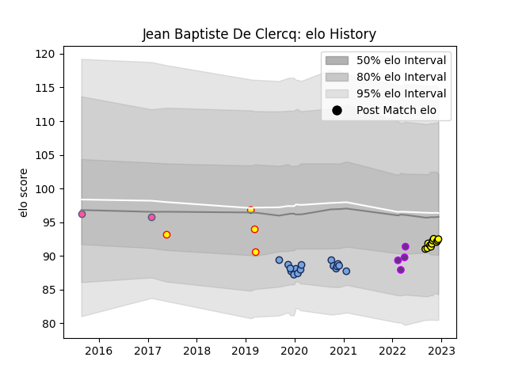

---  
layout: page  
title: Jean Baptiste De Clercq  
date: 2022-12-09 13:05:34.827962  
categories: player  
---
# Jean Baptiste De Clercq

## Positions: P

## Country: Belgium

## Current elo: 92.0

## Current Percentile: 31.0

# Elo History

# Match History

| Team                 |   Appearances |   Win Rate |
|:---------------------|--------------:|-----------:|
| Bayonne              |            16 |     0.3125 |
| Albi                 |            10 |     0.65   |
| Belgium              |             4 |     0.5    |
| US Bressane          |             4 |     0      |
| Stade Francais Paris |             2 |     0.5    |

| Opponent                   |   Matches |   Win Rate |
|:---------------------------|----------:|-----------:|
| Stade Francais Paris       |         3 |   0.666667 |
| Narbonne                   |         2 |   0.5      |
| Toulon                     |         2 |   0.5      |
| Lyon                       |         2 |   0        |
| Montpellier Herault        |         2 |   0.5      |
| Nice                       |         1 |   0.5      |
| US Bressane                |         1 |   1        |
| Suresnes                   |         1 |   0        |
| Stade Toulousain           |         1 |   0        |
| Spain                      |         1 |   0        |
| Scarlets                   |         1 |   0        |
| Romania                    |         1 |   0        |
| Racing 92                  |         1 |   0        |
| Portugal                   |         1 |   1        |
| Pau                        |         1 |   1        |
| Oyonnax                    |         1 |   0        |
| Agen                       |         1 |   0        |
| Bayonne                    |         1 |   0        |
| London Irish               |         1 |   1        |
| La Rochelle                |         1 |   0        |
| Grenoble                   |         1 |   0        |
| Germany                    |         1 |   1        |
| Dax                        |         1 |   1        |
| Chambery                   |         1 |   1        |
| Carqueiranne-Hyères        |         1 |   0        |
| Carcassonne                |         1 |   0        |
| Bourgoin-Jallieu           |         1 |   1        |
| Bordeaux Begles            |         1 |   0        |
| Blagnac                    |         1 |   0        |
| Valence Romans Drome Rugby |         1 |   1        |