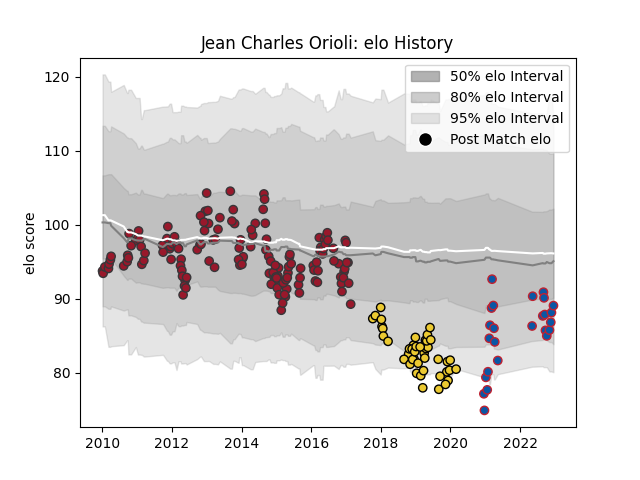

---  
layout: page  
title: Jean Charles Orioli  
date: 2023-01-13 11:29:31.283574  
categories: player  
---
# Jean Charles Orioli

## Positions: H

## Current elo: 97.0

## Current Percentile: 36.0

# Elo History

# Match History

| Team        |   Appearances |   Win Rate |
|:------------|--------------:|-----------:|
| Toulon      |           161 |   0.649068 |
| La Rochelle |            49 |   0.602041 |
| Grenoble    |            30 |   0.65     |

| Opponent             |   Matches |   Win Rate |
|:---------------------|----------:|-----------:|
| Racing 92            |        17 |   0.529412 |
| Stade Francais Paris |        16 |   0.65625  |
| Clermont Auvergne    |        15 |   0.4      |
| Castres Olympique    |        14 |   0.535714 |
| Montpellier Herault  |        13 |   0.461538 |
| Lyon                 |        11 |   0.818182 |
| Stade Toulousain     |        10 |   0.3      |
| Bayonne              |        10 |   0.6      |
| Bordeaux Begles      |        10 |   0.6      |
| Agen                 |         9 |   0.666667 |
| Brive                |         8 |   0.75     |
| Grenoble             |         7 |   0.857143 |
| Perpignan            |         6 |   0.75     |
| Oyonnax              |         6 |   0.583333 |
| La Rochelle          |         6 |   0.5      |
| Biarritz Olympique   |         5 |   0.6      |
| Scarlets             |         4 |   0.75     |
| Sale Sharks          |         4 |   0.75     |
| Cardiff Blues        |         4 |   0.75     |
| Saracens             |         4 |   0.5      |
| Provence Rugby       |         3 |   0.5      |
| Mont-de-Marsan       |         3 |   0.666667 |
| Toulon               |         3 |   0.666667 |
| Bourgoin-Jallieu     |         3 |   1        |
| Colomiers            |         3 |   0.333333 |
| Bristol Rugby        |         3 |   0.666667 |
| Pau                  |         3 |   1        |
| Soyaux-Angouleme     |         2 |   0.5      |
| Rouen                |         2 |   0.5      |
| Ulster               |         2 |   0.5      |
| Vannes               |         2 |   0.5      |
| Montauban            |         2 |   1        |
| Leicester Tigers     |         2 |   0.5      |
| Exeter Chiefs        |         2 |   1        |
| Munster              |         2 |   1        |
| Beziers              |         2 |   1        |
| Aurillac             |         2 |   1        |
| Carcassonne          |         2 |   1        |
| Leinster             |         2 |   1        |
| Newcastle Falcons    |         2 |   0.5      |
| Harlequins           |         2 |   1        |
| Glasgow Warriors     |         2 |   0.5      |
| Wasps                |         1 |   1        |
| Bath Rugby           |         1 |   1        |
| US Bressane          |         1 |   1        |
| Ospreys              |         1 |   1        |
| London Irish         |         1 |   1        |
| Massy                |         1 |   1        |
| RC Enisei            |         1 |   1        |
| Petrarca Padova      |         1 |   1        |
| Nevers               |         1 |   1        |
| Zebre                |         1 |   1        |