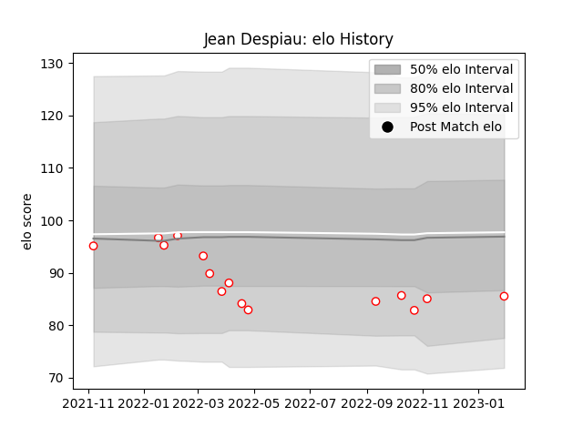

---  
layout: page  
title: Jean Despiau  
date: 2023-02-02 19:13:58.007712  
categories: player  
---
# Jean Despiau

## Positions: FL, N8

## Current elo: 86.0

## Current Percentile: 22.0

# Elo History

# Match History

| Team   |   Appearances |   Win Rate |
|:-------|--------------:|-----------:|
| Dax    |            15 |   0.533333 |

| Opponent                   |   Matches |   Win Rate |
|:---------------------------|----------:|-----------:|
| Bourgoin-Jallieu           |         2 |        0.5 |
| Cognac Saint Jean d'Angély |         2 |        0.5 |
| Nice                       |         2 |        0.5 |
| Tarbes                     |         2 |        0.5 |
| Blagnac                    |         1 |        1   |
| Chambery                   |         1 |        1   |
| Dijon                      |         1 |        0   |
| Massy                      |         1 |        0   |
| Rennes                     |         1 |        1   |
| Suresnes                   |         1 |        1   |
| Valence Romans Drome Rugby |         1 |        0   |