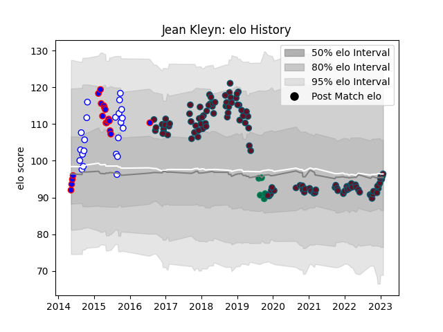

---  
layout: page  
title: Jean Kleyn  
date: 2023-01-06 00:12:47.672757  
categories: player  
---
# Jean Kleyn

## Positions: L

## Country: Ireland

## Current elo: 110.0

## Current Percentile: 68.0

# Elo History

# Match History

| Team             |   Appearances |   Win Rate |
|:-----------------|--------------:|-----------:|
| Munster          |           111 |   0.698198 |
| Western Province |            22 |   0.772727 |
| Stormers         |            19 |   0.657895 |
| Ireland          |             5 |   0.8      |

| Opponent                 |   Matches |   Win Rate |
|:-------------------------|----------:|-----------:|
| Leinster                 |        11 |   0.181818 |
| Connacht                 |        11 |   0.818182 |
| Edinburgh                |         8 |   0.875    |
| Glasgow Warriors         |         8 |   0.625    |
| Ulster                   |         7 |   0.642857 |
| Cardiff Blues            |         7 |   0.571429 |
| Dragons                  |         7 |   0.857143 |
| Cheetahs                 |         6 |   0.833333 |
| Racing 92                |         6 |   0.416667 |
| Ospreys                  |         6 |   0.833333 |
| Blue Bulls               |         6 |   0.833333 |
| Golden Lions             |         5 |   0.4      |
| Bulls                    |         5 |   0.6      |
| Scarlets                 |         5 |   0.8      |
| Sharks                   |         4 |   0.75     |
| Leicester Tigers         |         4 |   0.75     |
| Zebre                    |         4 |   1        |
| Benetton Treviso         |         3 |   1        |
| Southern Kings           |         3 |   1        |
| Castres Olympique        |         3 |   1        |
| Saracens                 |         3 |   0.333333 |
| Griquas                  |         3 |   1        |
| Eastern Province Kings   |         3 |   1        |
| Pumas                    |         2 |   1        |
| Western Force            |         2 |   1        |
| Brumbies                 |         2 |   0.5      |
| Gloucester Rugby         |         2 |   1        |
| Free State Cheetahs      |         2 |   0.5      |
| Lions                    |         2 |   0.25     |
| Exeter Chiefs            |         2 |   0.75     |
| Stade Toulousain         |         1 |   0        |
| Highlanders              |         1 |   0        |
| Wasps                    |         1 |   1        |
| Wales                    |         1 |   1        |
| Italy                    |         1 |   1        |
| Toulon                   |         1 |   1        |
| Stormers                 |         1 |   1        |
| Northampton Saints       |         1 |   1        |
| England                  |         1 |   0        |
| Chiefs                   |         1 |   0        |
| Samoa                    |         1 |   1        |
| Melbourne Rebels         |         1 |   1        |
| Natal Sharks             |         1 |   1        |
| New South Wales Waratahs |         1 |   1        |
| Russia                   |         1 |   1        |