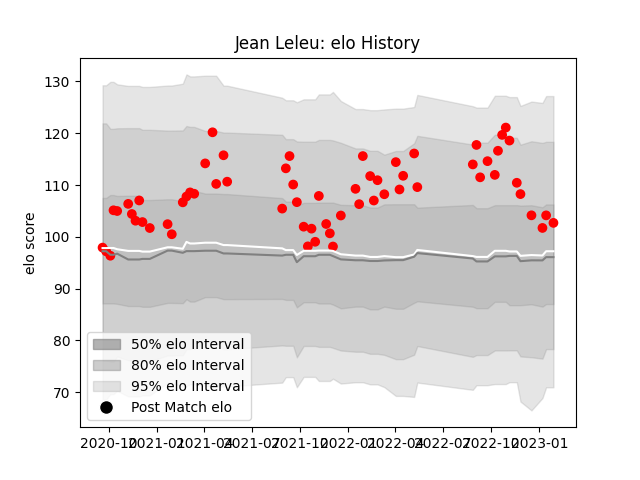

---  
layout: page  
title: Jean Leleu  
date: 2023-01-13 11:34:28.567159  
categories: player  
---
# Jean Leleu

## Positions: FL, L

## Current elo: 102.0

## Current Percentile: 81.0

# Elo History

# Match History

| Team   |   Appearances |   Win Rate |
|:-------|--------------:|-----------:|
| Rouen  |            61 |   0.385246 |

| Opponent           |   Matches |   Win Rate |
|:-------------------|----------:|-----------:|
| Vannes             |         5 |   0.6      |
| Carcassonne        |         5 |   0        |
| Grenoble           |         4 |   0.5      |
| Oyonnax            |         4 |   0.5      |
| Nevers             |         4 |   0.25     |
| Aurillac           |         4 |   0.25     |
| Agen               |         4 |   0.25     |
| Colomiers          |         4 |   0.25     |
| Beziers            |         4 |   0.75     |
| Mont-de-Marsan     |         4 |   0.25     |
| Biarritz Olympique |         3 |   0.333333 |
| Montauban          |         3 |   0        |
| Provence Rugby     |         3 |   0.666667 |
| Narbonne           |         2 |   0.5      |
| Bayonne            |         2 |   0        |
| Perpignan          |         2 |   0.5      |
| Soyaux-Angouleme   |         2 |   1        |
| Massy              |         1 |   1        |
| US Bressane        |         1 |   0.5      |