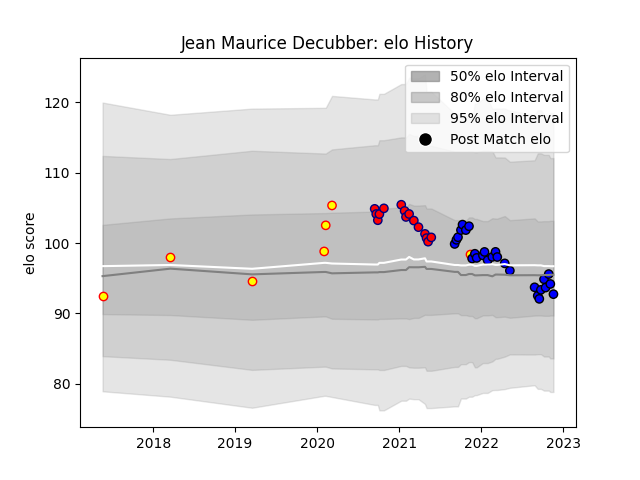

---  
layout: page  
title: Jean Maurice Decubber  
date: 2023-02-02 19:13:32.317220  
categories: player  
---
# Jean Maurice Decubber

## Positions: FL

## Country: Belgium

## Current elo: 96.0

## Current Percentile: 47.0

# Elo History

# Match History

| Team                       |   Appearances |   Win Rate |
|:---------------------------|--------------:|-----------:|
| Massy                      |            33 |   0.636364 |
| Cognac Saint Jean d'Angély |            15 |   0.366667 |
| Belgium                    |             7 |   0.428571 |

| Opponent                   |   Matches |   Win Rate |
|:---------------------------|----------:|-----------:|
| Tarbes                     |         4 |   0.625    |
| Blagnac                    |         4 |   0.25     |
| Albi                       |         3 |   0.333333 |
| Soyaux-Angouleme           |         3 |   0.333333 |
| Nice                       |         3 |   0.333333 |
| Aubenas                    |         3 |   1        |
| Mont-de-Marsan             |         2 |   0.5      |
| Valence Romans Drome Rugby |         2 |   1        |
| Suresnes                   |         2 |   1        |
| Spain                      |         2 |   0.5      |
| Portugal                   |         2 |   0.5      |
| Montauban                  |         2 |   0.5      |
| Narbonne                   |         2 |   0        |
| Dax                        |         2 |   1        |
| Chambery                   |         2 |   1        |
| Dijon                      |         2 |   1        |
| Bourgoin-Jallieu           |         2 |   1        |
| Massy                      |         1 |   0        |
| Canada                     |         1 |   0        |
| Aurillac                   |         1 |   0        |
| US Bressane                |         1 |   0        |
| Beziers                    |         1 |   0        |
| Biarritz Olympique         |         1 |   0        |
| Rouen                      |         1 |   0        |
| Russia                     |         1 |   1        |
| Romania                    |         1 |   0        |
| Provence Rugby             |         1 |   1        |
| Carcassonne                |         1 |   1        |
| Nevers                     |         1 |   0        |
| Vannes                     |         1 |   1        |