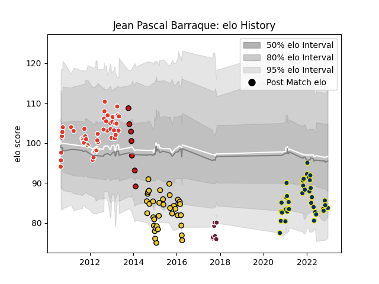

---  
layout: page  
title: Jean Pascal Barraque  
date: 2022-12-18 16:34:41.454595  
categories: player  
---
# Jean Pascal Barraque

## Positions: C, FH

## Current elo: 84.0

## Current Percentile: 17.0

# Elo History

# Match History

| Team               |   Appearances |   Win Rate |
|:-------------------|--------------:|-----------:|
| Biarritz Olympique |            52 |   0.519231 |
| La Rochelle        |            38 |   0.381579 |
| Clermont Auvergne  |            37 |   0.554054 |
| Bordeaux Begles    |             7 |   0.571429 |
| Stade Toulousain   |             7 |   0.428571 |

| Opponent             |   Matches |   Win Rate |
|:---------------------|----------:|-----------:|
| Stade Toulousain     |        11 |   0.454545 |
| Racing 92            |        11 |   0.136364 |
| Toulon               |         9 |   0.444444 |
| Brive                |         9 |   0.555556 |
| Montpellier Herault  |         9 |   0.5      |
| Bayonne              |         9 |   0.333333 |
| Bordeaux Begles      |         8 |   0.5625   |
| Stade Francais Paris |         8 |   0.75     |
| Castres Olympique    |         7 |   0.285714 |
| Clermont Auvergne    |         7 |   0.571429 |
| Agen                 |         6 |   0.583333 |
| Perpignan            |         6 |   0.166667 |
| Grenoble             |         5 |   0.4      |
| Pau                  |         5 |   0.8      |
| Lyon                 |         4 |   1        |
| Zebre                |         4 |   1        |
| Connacht             |         4 |   0.25     |
| Oyonnax              |         3 |   1        |
| La Rochelle          |         3 |   0.333333 |
| Mont-de-Marsan       |         2 |   1        |
| Gloucester Rugby     |         2 |   0.5      |
| Exeter Chiefs        |         2 |   0        |
| Worcester Warriors   |         2 |   0.5      |
| Leicester Tigers     |         1 |   0        |
| Harlequins           |         1 |   0        |
| Biarritz Olympique   |         1 |   1        |
| Wasps                |         1 |   1        |
| Leinster             |         1 |   0        |