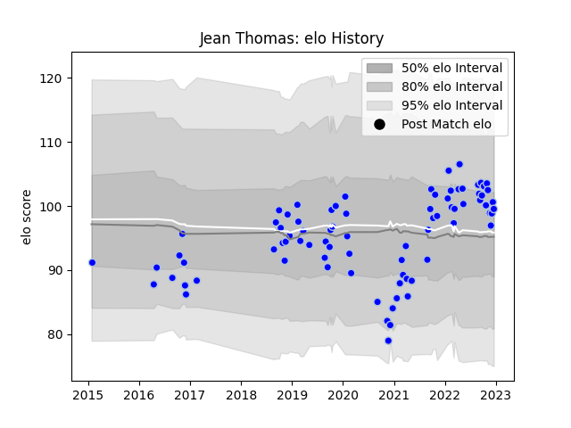

---  
layout: page  
title: Jean Thomas  
date: 2022-11-22 11:41:04.067378  
categories: player  
---
# Jean Thomas

## Positions: L, FL

## Current elo: 98.0

## Current Percentile: 64.0

# Elo History

# Match History

| Team      |   Appearances |   Win Rate |
|:----------|--------------:|-----------:|
| Colomiers |            77 |        0.5 |

| Opponent                   |   Matches |   Win Rate |
|:---------------------------|----------:|-----------:|
| Beziers                    |         8 |   0.625    |
| Nevers                     |         6 |   0.5      |
| Provence Rugby             |         6 |   0.5      |
| Oyonnax                    |         6 |   0.75     |
| Montauban                  |         5 |   0.4      |
| Rouen                      |         5 |   0.8      |
| Vannes                     |         5 |   0.6      |
| Aurillac                   |         4 |   0.25     |
| Carcassonne                |         4 |   0.5      |
| Grenoble                   |         3 |   0.666667 |
| Mont-de-Marsan             |         3 |   0.333333 |
| Soyaux-Angouleme           |         3 |   0.333333 |
| Perpignan                  |         3 |   0.666667 |
| Agen                       |         2 |   1        |
| US Bressane                |         2 |   0        |
| Narbonne                   |         2 |   0.5      |
| Roval Drome XV             |         2 |   1        |
| Valence Romans Drome Rugby |         1 |   0        |
| Brive                      |         1 |   0        |
| Bayonne                    |         1 |   0        |
| Biarritz Olympique         |         1 |   0        |
| Bourgoin-Jallieu           |         1 |   0        |
| Albi                       |         1 |   0        |
| Massy                      |         1 |   0        |
| Pau                        |         1 |   0        |