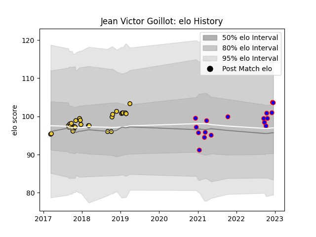

---  
layout: page  
title: Jean Victor Goillot  
date: 2022-12-09 13:23:36.539200  
categories: player  
---
# Jean Victor Goillot

## Positions: SH

## Current elo: 104.0

## Current Percentile: 66.0

# Elo History

# Match History

| Team        |   Appearances |   Win Rate |
|:------------|--------------:|-----------:|
| La Rochelle |            29 |   0.724138 |
| Beziers     |            16 |   0.375    |

| Opponent             |   Matches |   Win Rate |
|:---------------------|----------:|-----------:|
| Stade Francais Paris |         3 |   0.333333 |
| Clermont Auvergne    |         3 |   0.666667 |
| Agen                 |         2 |   1        |
| Montpellier Herault  |         2 |   0.5      |
| Wasps                |         2 |   0.5      |
| Soyaux-Angouleme     |         2 |   0        |
| Racing 92            |         2 |   1        |
| RC Enisei            |         2 |   1        |
| Oyonnax              |         2 |   0.5      |
| Nevers               |         2 |   0        |
| Montauban            |         2 |   1        |
| Zebre                |         2 |   1        |
| Brive                |         2 |   1        |
| Bayonne              |         1 |   0        |
| Ulster               |         1 |   1        |
| Toulon               |         1 |   0        |
| Stade Toulousain     |         1 |   1        |
| Biarritz Olympique   |         1 |   1        |
| Bordeaux Begles      |         1 |   0        |
| Bristol Rugby        |         1 |   1        |
| Harlequins           |         1 |   1        |
| Lyon                 |         1 |   1        |
| Pau                  |         1 |   0        |
| Carcassonne          |         1 |   1        |
| Colomiers            |         1 |   0        |
| Grenoble             |         1 |   1        |
| Aurillac             |         1 |   0        |
| Mont-de-Marsan       |         1 |   0        |
| Massy                |         1 |   1        |
| Provence Rugby       |         1 |   0        |