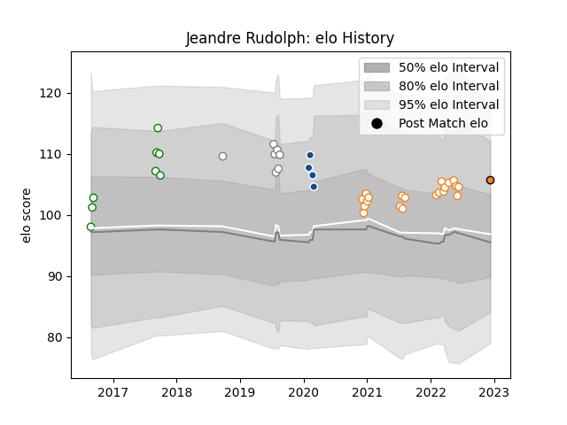

---  
layout: page  
title: Jeandre Rudolph  
date: 2023-01-17 11:35:03.693756  
categories: player  
---
# Jeandre Rudolph

## Positions: N8, FL

## Current elo: 93.0

## Current Percentile: 30.0

# Elo History

# Match History

| Team                |   Appearances |   Win Rate |
|:--------------------|--------------:|-----------:|
| Free State Cheetahs |            20 |   0.65     |
| Leopards            |            10 |   0.85     |
| Pumas               |            10 |   0.3      |
| Bulls               |             4 |   0        |
| Cheetahs            |             3 |   0.333333 |

| Opponent               |   Matches |   Win Rate |
|:-----------------------|----------:|-----------:|
| Western Province       |         6 |   0.5      |
| Natal Sharks           |         6 |   0.666667 |
| Golden Lions           |         4 |   0.25     |
| Pumas                  |         4 |   0.75     |
| Griquas                |         4 |   0.5      |
| Blue Bulls             |         4 |   0.5      |
| Griffons               |         3 |   0.666667 |
| Free State Cheetahs    |         2 |   0.5      |
| SWD Eagles             |         2 |   0.75     |
| Scarlets               |         2 |   0        |
| Eastern Province Kings |         1 |   1        |
| Jaguares               |         1 |   0        |
| Blues                  |         1 |   0        |
| Border Bulldogs        |         1 |   1        |
| Pau                    |         1 |   1        |
| Boland Cavaliers       |         1 |   1        |
| Sharks                 |         1 |   0        |
| Stormers               |         1 |   0        |
| Valke                  |         1 |   1        |
| Namibia Welwitchias    |         1 |   1        |