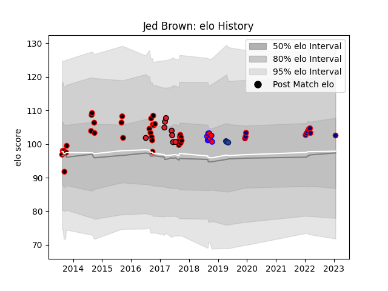

---  
layout: page  
title: Jed Brown  
date: 2023-03-17 17:37:02.343075  
categories: player  
---
# Jed Brown

## Positions: FL

## Country: Crusaders

## Current elo: 104.0

## Current Percentile: 74.0

# Elo History

# Match History

| Team                     |   Appearances |   Win Rate |
|:-------------------------|--------------:|-----------:|
| Canterbury               |            33 |   0.848485 |
| Hanazono Kintetsu Liners |            12 |   0.75     |
| Crusaders                |             8 |   0.625    |
| Tasman                   |             8 |   0.75     |
| Blues                    |             3 |   0        |

| Opponent                |   Matches |   Win Rate |
|:------------------------|----------:|-----------:|
| North Harbour           |         5 |   0.8      |
| Waikato                 |         4 |   1        |
| Counties Manukau        |         4 |   0.75     |
| Hawke's Bay             |         4 |   1        |
| Auckland                |         3 |   0.666667 |
| Highlanders             |         3 |   0.666667 |
| Tasman                  |         3 |   1        |
| Taranaki                |         3 |   1        |
| Southland               |         3 |   0.666667 |
| Otago                   |         3 |   1        |
| Manawatu                |         3 |   0.666667 |
| Hurricanes              |         2 |   0        |
| Mitsubishi Dynaboars    |         2 |   0        |
| Canterbury              |         2 |   0.5      |
| Skyactivs Hiroshima     |         2 |   1        |
| Chiefs                  |         2 |   0        |
| Kamaishi Seawaves       |         2 |   1        |
| Coca-Cola Red Sparks    |         2 |   1        |
| Northland               |         2 |   1        |
| Mie Honda Heat          |         1 |   1        |
| Melbourne Rebels        |         1 |   1        |
| Mazda Blue Zoomers      |         1 |   1        |
| Saitama Wild Knights    |         1 |   0        |
| Bay of Plenty           |         1 |   1        |
| Kyuden Voltex           |         1 |   1        |
| Brumbies                |         1 |   1        |
| British and Irish Lions |         1 |   0        |
| Blues                   |         1 |   1        |
| Wellington              |         1 |   0        |