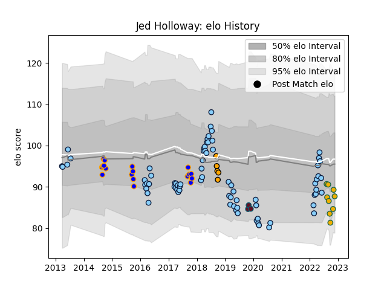

---  
layout: page  
title: Jed Holloway  
date: 2022-11-22 11:36:41.192465  
categories: player  
---
# Jed Holloway

## Positions: N8, L

## Country: Australia

## Current elo: 88.0

## Current Percentile: 23.0

# Elo History

# Match History

| Team                     |   Appearances |   Win Rate |
|:-------------------------|--------------:|-----------:|
| New South Wales Waratahs |            75 |   0.46     |
| Greater Sydney Rams      |            18 |   0.361111 |
| Australia                |             9 |   0.333333 |
| NSW Country Eagles       |             5 |   0        |
| Munster                  |             3 |   0.666667 |

| Opponent           |   Matches |   Win Rate |
|:-------------------|----------:|-----------:|
| Queensland Reds    |        10 |   0.7      |
| Melbourne Rebels   |        10 |   0.7      |
| Brumbies           |         9 |   0.111111 |
| Crusaders          |         7 |   0.285714 |
| Western Force      |         6 |   0.833333 |
| Highlanders        |         5 |   0.4      |
| Blues              |         5 |   0.2      |
| Chiefs             |         5 |   0        |
| Melbourne Rising   |         4 |   0        |
| Fijian Drua        |         3 |   0.666667 |
| Hurricanes         |         3 |   0        |
| Sunwolves          |         3 |   1        |
| Lions              |         3 |   0.333333 |
| Canberra Vikings   |         3 |   0        |
| Queensland Country |         3 |   0        |
| Perth Spirit       |         2 |   0.5      |
| Sydney Stars       |         2 |   0.5      |
| Stormers           |         2 |   1        |
| South Africa       |         2 |   0.5      |
| Sharks             |         2 |   0.25     |
| Brisbane City      |         2 |   0.5      |
| Argentina          |         2 |   0.5      |
| North Harbour Rays |         2 |   0.75     |
| New Zealand        |         2 |   0        |
| NSW Country Eagles |         2 |   0.5      |
| Jaguares           |         2 |   0        |
| France             |         1 |   0        |
| Scotland           |         1 |   1        |
| Moana Pasifika     |         1 |   1        |
| Cardiff Blues      |         1 |   1        |
| Southern Kings     |         1 |   0        |
| Ireland            |         1 |   0        |
| Sydney Rays        |         1 |   1        |
| Edinburgh          |         1 |   0        |
| Ospreys            |         1 |   1        |