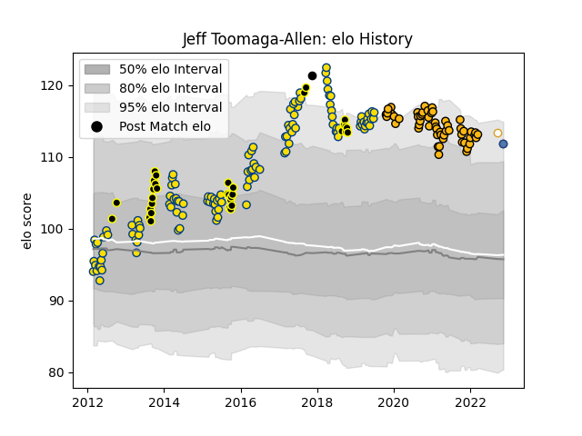

---  
layout: page  
title: Jeff Toomaga-Allen  
date: 2023-01-13 11:27:56.113880  
categories: player  
---
# Jeff Toomaga-Allen

## Positions: P

## Country: Samoa

## Current elo: 114.0

## Current Percentile: 91.0

# Elo History

# Match History

| Team        |   Appearances |   Win Rate |
|:------------|--------------:|-----------:|
| Hurricanes  |           118 |   0.665254 |
| Wasps       |            56 |   0.428571 |
| Wellington  |            34 |   0.691176 |
| Samoa       |             3 |   0.666667 |
| Ulster      |             3 |   0.666667 |
| New Zealand |             2 |   1        |

| Opponent                 |   Matches |   Win Rate |
|:-------------------------|----------:|-----------:|
| Crusaders                |        14 |   0.428571 |
| Chiefs                   |        14 |   0.5      |
| Blues                    |        13 |   0.846154 |
| Highlanders              |        13 |   0.538462 |
| Brumbies                 |         8 |   0.5      |
| Melbourne Rebels         |         7 |   1        |
| Bath Rugby               |         6 |   1        |
| New South Wales Waratahs |         6 |   0.666667 |
| Northampton Saints       |         6 |   0.333333 |
| Sharks                   |         6 |   0.666667 |
| Queensland Reds          |         6 |   0.833333 |
| Sale Sharks              |         5 |   0.2      |
| Manawatu                 |         5 |   0.8      |
| Harlequins               |         5 |   0.2      |
| Exeter Chiefs            |         5 |   0.4      |
| Lions                    |         5 |   0.8      |
| Bulls                    |         5 |   0.8      |
| Stormers                 |         5 |   0.4      |
| Bristol Rugby            |         5 |   0.6      |
| Western Force            |         5 |   1        |
| London Irish             |         4 |   0.5      |
| Cheetahs                 |         4 |   0.75     |
| Canterbury               |         4 |   0.5      |
| Gloucester Rugby         |         4 |   0        |
| Worcester Warriors       |         4 |   0.75     |
| Leicester Tigers         |         4 |   0.5      |
| Otago                    |         3 |   0.666667 |
| Newcastle Falcons        |         3 |   0.333333 |
| Sunwolves                |         3 |   1        |
| Auckland                 |         3 |   0.333333 |
| Bay of Plenty            |         3 |   1        |
| Hawke's Bay              |         3 |   0.166667 |
| Counties Manukau         |         3 |   1        |
| Waikato                  |         2 |   1        |
| Tasman                   |         2 |   0        |
| Northland                |         2 |   1        |
| Taranaki                 |         2 |   1        |
| Edinburgh                |         2 |   0        |
| Jaguares                 |         2 |   0.5      |
| Japan                    |         1 |   1        |
| Southland                |         1 |   1        |
| Benetton Treviso         |         1 |   0        |
| Bordeaux Begles          |         1 |   0        |
| British and Irish Lions  |         1 |   0.5      |
| Saracens                 |         1 |   1        |
| Southern Kings           |         1 |   1        |
| Connacht                 |         1 |   1        |
| Romania                  |         1 |   1        |
| France                   |         1 |   1        |
| Georgia                  |         1 |   1        |
| North Harbour            |         1 |   1        |
| Italy                    |         1 |   0        |
| Munster                  |         1 |   0        |
| Zebre                    |         1 |   1        |