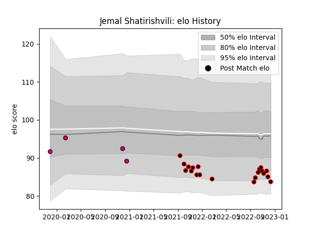

---  
layout: page  
title: Jemal Shatirishvili  
date: 2022-12-14 11:27:07.335981  
categories: player  
---
# Jemal Shatirishvili

## Positions: P

## Current elo: 84.0

## Current Percentile: 11.0

# Elo History

# Match History

| Team     |   Appearances |   Win Rate |
|:---------|--------------:|-----------:|
| Nice     |            20 |      0.475 |
| Aurillac |             4 |      0.25  |

| Opponent                   |   Matches |   Win Rate |
|:---------------------------|----------:|-----------:|
| Bourgoin-Jallieu           |         3 |   0.333333 |
| Valence Romans Drome Rugby |         2 |   0.5      |
| Blagnac                    |         2 |   0.5      |
| Chambery                   |         2 |   0.5      |
| Suresnes                   |         2 |   0.5      |
| Montauban                  |         1 |   0        |
| US Bressane                |         1 |   0        |
| Tarbes                     |         1 |   1        |
| Soyaux-Angouleme           |         1 |   0        |
| Perpignan                  |         1 |   0        |
| Albi                       |         1 |   0.5      |
| Massy                      |         1 |   0        |
| Aubenas                    |         1 |   1        |
| Dax                        |         1 |   0        |
| Cognac Saint Jean d'Angély |         1 |   1        |
| Carqueiranne-Hyères        |         1 |   1        |
| Beziers                    |         1 |   0        |
| Dijon                      |         1 |   1        |