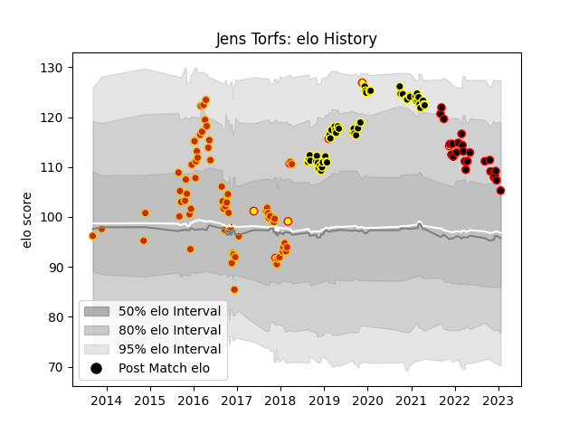

---  
layout: page  
title: Jens Torfs  
date: 2023-01-23 15:32:09.759393  
categories: player  
---
# Jens Torfs

## Positions: C

## Country: Belgium

## Current elo: 105.0

## Current Percentile: 76.0

# Elo History

# Match History

| Team           |   Appearances |   Win Rate |
|:---------------|--------------:|-----------:|
| Perpignan      |            65 |   0.561538 |
| Mont-de-Marsan |            51 |   0.5      |
| Nice           |            25 |   0.56     |
| Belgium        |             7 |   0.571429 |

| Opponent                   |   Matches |   Win Rate |
|:---------------------------|----------:|-----------:|
| Montauban                  |        10 |   0.5      |
| Colomiers                  |         8 |   0.3125   |
| Carcassonne                |         8 |   0.75     |
| Aurillac                   |         8 |   0.5      |
| Dax                        |         8 |   0.375    |
| Vannes                     |         7 |   0.428571 |
| Provence Rugby             |         6 |   0.5      |
| Beziers                    |         6 |   0.5      |
| Soyaux-Angouleme           |         6 |   0.666667 |
| Narbonne                   |         5 |   0.6      |
| Mont-de-Marsan             |         5 |   0.4      |
| Biarritz Olympique         |         5 |   0.4      |
| Oyonnax                    |         4 |   0.375    |
| Grenoble                   |         4 |   0.75     |
| Nevers                     |         4 |   0.5      |
| Massy                      |         4 |   1        |
| Albi                       |         3 |   0.666667 |
| Bourgoin-Jallieu           |         3 |   0.666667 |
| Cognac Saint Jean d'Angély |         3 |   0.666667 |
| Bayonne                    |         3 |   0.5      |
| Blagnac                    |         3 |   0.666667 |
| Tarbes                     |         3 |   1        |
| US Bressane                |         3 |   0.333333 |
| Valence Romans Drome Rugby |         3 |   0.5      |
| Rouen                      |         2 |   1        |
| Perpignan                  |         2 |   0.5      |
| Germany                    |         2 |   1        |
| Brive                      |         2 |   0.5      |
| Suresnes                   |         2 |   0.5      |
| Spain                      |         1 |   1        |
| Roval Drome XV             |         1 |   0        |
| Rennes                     |         1 |   1        |
| Toulon                     |         1 |   0        |
| Agen                       |         1 |   0        |
| Racing 92                  |         1 |   0        |
| Portugal                   |         1 |   1        |
| Pau                        |         1 |   0        |
| Hong Kong                  |         1 |   0        |
| Dijon                      |         1 |   0        |
| Chambery                   |         1 |   1        |
| Carqueiranne-Hyères        |         1 |   1        |
| Canada                     |         1 |   0        |
| Brazil                     |         1 |   0        |
| Aubenas                    |         1 |   1        |
| Lyon                       |         1 |   1        |