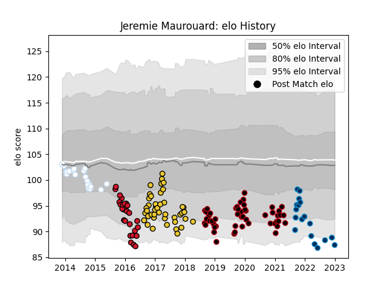

---  
layout: page  
title: Jeremie Maurouard  
date: 2023-01-01 11:18:38.828690  
categories: player  
---
# Jeremie Maurouard

## Positions: H

## Current elo: 82.0

## Current Percentile: 6.0

# Elo History

# Match History

| Team                |   Appearances |   Win Rate |
|:--------------------|--------------:|-----------:|
| Lyon                |            51 |   0.480392 |
| La Rochelle         |            44 |   0.659091 |
| Oyonnax             |            27 |   0.148148 |
| Racing 92           |            21 |   0.47619  |
| Montpellier Herault |            18 |   0.472222 |

| Opponent             |   Matches |   Win Rate |
|:---------------------|----------:|-----------:|
| Stade Toulousain     |        12 |   0.541667 |
| Castres Olympique    |        12 |   0.333333 |
| Clermont Auvergne    |        12 |   0.125    |
| Montpellier Herault  |        11 |   0.545455 |
| Toulon               |        11 |   0.454545 |
| Bordeaux Begles      |        10 |   0.2      |
| Stade Francais Paris |        10 |   0.6      |
| Brive                |         9 |   0.555556 |
| Bayonne              |         8 |   1        |
| La Rochelle          |         8 |   0.5      |
| Racing 92            |         7 |   0.5      |
| Pau                  |         7 |   0.714286 |
| Agen                 |         5 |   0.8      |
| Grenoble             |         5 |   0.4      |
| Benetton Treviso     |         5 |   0.8      |
| Saracens             |         4 |   0        |
| Lyon                 |         4 |   0.5      |
| Northampton Saints   |         3 |   0.333333 |
| Ulster               |         2 |   0        |
| Leinster             |         2 |   0        |
| Oyonnax              |         2 |   0.25     |
| Gloucester Rugby     |         2 |   0.5      |
| Cardiff Blues        |         2 |   0        |
| Biarritz Olympique   |         2 |   1        |
| Perpignan            |         1 |   1        |
| Harlequins           |         1 |   0        |
| Scarlets             |         1 |   0        |
| Glasgow Warriors     |         1 |   0        |
| Edinburgh            |         1 |   1        |
| Wasps                |         1 |   1        |