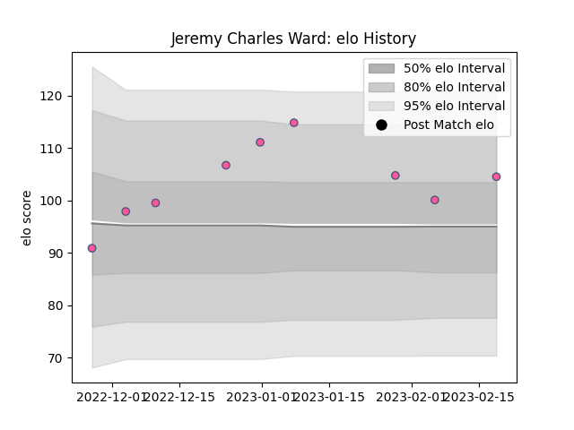

---  
layout: page  
title: Jeremy Charles Ward  
date: 2023-02-24 02:32:46.678430  
categories: player  
---
# Jeremy Charles Ward

## Positions: C

## Current elo: 105.0

## Current Percentile: 65.0

# Elo History

# Match History

| Team                 |   Appearances |   Win Rate |
|:---------------------|--------------:|-----------:|
| Stade Francais Paris |             9 |   0.666667 |

| Opponent          |   Matches |   Win Rate |
|:------------------|----------:|-----------:|
| Bayonne           |         1 |          0 |
| Benetton Treviso  |         1 |          1 |
| Bordeaux Begles   |         1 |          1 |
| Castres Olympique |         1 |          1 |
| La Rochelle       |         1 |          1 |
| Pau               |         1 |          1 |
| Perpignan         |         1 |          0 |
| Racing 92         |         1 |          1 |
| Toulon            |         1 |          0 |