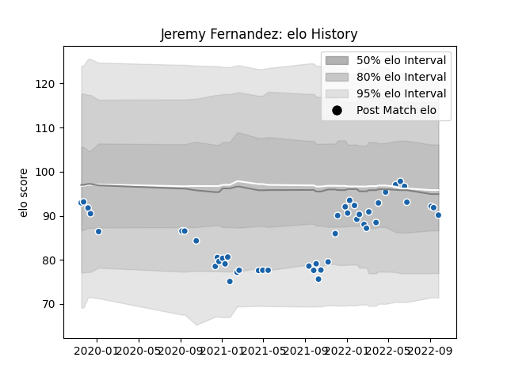

---  
layout: page  
title: Jeremy Fernandez  
date: 2023-03-27 11:37:00.750691  
categories: player  
---
# Jeremy Fernandez

Last updated: 2023-03-27
## Positions: SH

## Current elo: 90.0

## Current Percentile: 54.0

# Elo History

# Match History

| Team              |   Appearances |   Win Rate |
|:------------------|--------------:|-----------:|
| Castres Olympique |            47 |   0.574468 |

| Opponent             |   Matches |   Win Rate |
|:---------------------|----------:|-----------:|
| Montpellier Herault  |         5 |   0.6      |
| Stade Francais Paris |         4 |   0.5      |
| Racing 92            |         4 |   0.25     |
| Toulon               |         3 |   0.666667 |
| Stade Toulousain     |         3 |   1        |
| Brive                |         3 |   0.333333 |
| Clermont Auvergne    |         3 |   0.666667 |
| La Rochelle          |         3 |   0.333333 |
| Lyon                 |         3 |   0.666667 |
| Perpignan            |         2 |   1        |
| RC Enisei            |         2 |   1        |
| Agen                 |         2 |   1        |
| Bordeaux Begles      |         2 |   0        |
| Ospreys              |         1 |   0        |
| Pau                  |         1 |   1        |
| Newcastle Falcons    |         1 |   0        |
| Bayonne              |         1 |   1        |
| Harlequins           |         1 |   0        |
| Dragons              |         1 |   0        |
| Biarritz Olympique   |         1 |   1        |
| Worcester Warriors   |         1 |   1        |