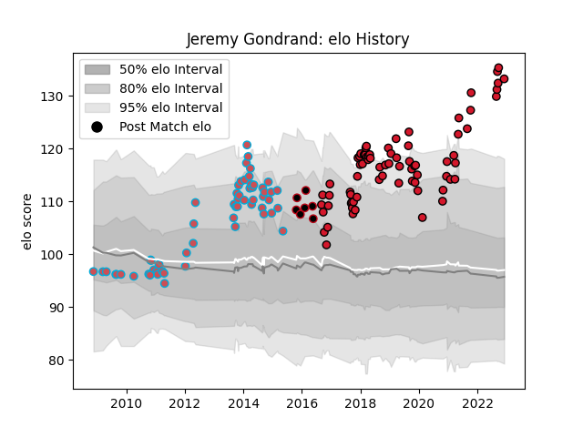

---  
layout: page  
title: Jeremy Gondrand  
date: 2022-12-14 11:15:25.278111  
categories: player  
---
# Jeremy Gondrand

## Positions: SH, FH

## Current elo: 132.0

## Current Percentile: 99.0

# Elo History

# Match History

| Team             |   Appearances |   Win Rate |
|:-----------------|--------------:|-----------:|
| Oyonnax          |            76 |   0.532895 |
| Bourgoin-Jallieu |            58 |   0.293103 |
| Lyon             |             7 |   0.714286 |

| Opponent                   |   Matches |   Win Rate |
|:---------------------------|----------:|-----------:|
| Aurillac                   |         7 |   0.357143 |
| Beziers                    |         7 |   0.428571 |
| Dax                        |         7 |   0.571429 |
| Agen                       |         6 |   0.5      |
| Pau                        |         6 |   0.166667 |
| Biarritz Olympique         |         6 |   0.5      |
| Carcassonne                |         6 |   0.833333 |
| Brive                      |         5 |   0.2      |
| Stade Toulousain           |         5 |   0.1      |
| Mont-de-Marsan             |         5 |   0.4      |
| Vannes                     |         4 |   0.75     |
| Lyon                       |         4 |   0.5      |
| Perpignan                  |         4 |   0.25     |
| Castres Olympique          |         4 |   0        |
| Narbonne                   |         4 |   0.5      |
| Montauban                  |         4 |   1        |
| Massy                      |         4 |   0.75     |
| Montpellier Herault        |         4 |   0        |
| La Rochelle                |         4 |   0.25     |
| Grenoble                   |         4 |   0.5      |
| Colomiers                  |         4 |   0.25     |
| Albi                       |         3 |   0.333333 |
| Nevers                     |         3 |   1        |
| Clermont Auvergne          |         3 |   0.5      |
| US Bressane                |         3 |   0.333333 |
| Toulon                     |         3 |   0.333333 |
| Soyaux-Angouleme           |         3 |   1        |
| Tarbes                     |         2 |   0.5      |
| Bordeaux Begles            |         2 |   0.5      |
| Bayonne                    |         2 |   0        |
| Racing 92                  |         2 |   0        |
| Rouen                      |         2 |   0.5      |
| Stade Francais Paris       |         2 |   0.5      |
| Valence Romans Drome Rugby |         1 |   1        |
| Bourgoin-Jallieu           |         1 |   1        |
| Auch                       |         1 |   0        |
| Roval Drome XV             |         1 |   1        |
| Provence Rugby             |         1 |   1        |
| Exeter Chiefs              |         1 |   0        |
| Newcastle Falcons          |         1 |   0        |