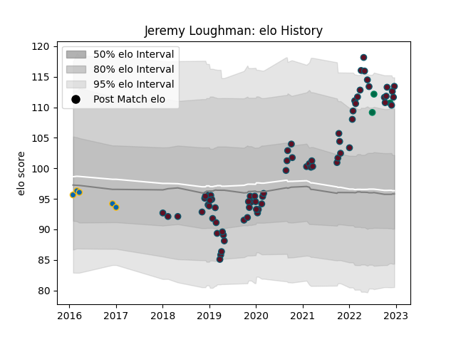

---  
layout: page  
title: Jeremy Loughman  
date: 2022-12-14 11:26:17.605197  
categories: player  
---
# Jeremy Loughman

## Positions: P

## Country: Ireland

## Current elo: 112.0

## Current Percentile: 93.0

# Elo History

# Match History

| Team     |   Appearances |   Win Rate |
|:---------|--------------:|-----------:|
| Munster  |            71 |   0.71831  |
| Leinster |             5 |   0.6      |
| Ireland  |             3 |   0.666667 |

| Opponent          |   Matches |   Win Rate |
|:------------------|----------:|-----------:|
| Connacht          |         9 |   0.777778 |
| Ulster            |         8 |   0.4375   |
| Leinster          |         7 |   0.142857 |
| Zebre             |         7 |   1        |
| Edinburgh         |         6 |   1        |
| Ospreys           |         5 |   0.8      |
| Scarlets          |         5 |   0.8      |
| Dragons           |         5 |   0.8      |
| Benetton Treviso  |         4 |   1        |
| Cardiff Blues     |         3 |   1        |
| Glasgow Warriors  |         2 |   0        |
| New Zealand Maori |         2 |   0.5      |
| Castres Olympique |         2 |   0.5      |
| Racing 92         |         2 |   0.25     |
| Southern Kings    |         2 |   1        |
| Fiji              |         1 |   1        |
| Gloucester Rugby  |         1 |   1        |
| Bulls             |         1 |   1        |
| Saracens          |         1 |   0        |
| Exeter Chiefs     |         1 |   1        |
| Sharks            |         1 |   1        |
| Stade Toulousain  |         1 |   0        |
| Stormers          |         1 |   1        |
| Wasps             |         1 |   1        |
| Cheetahs          |         1 |   1        |