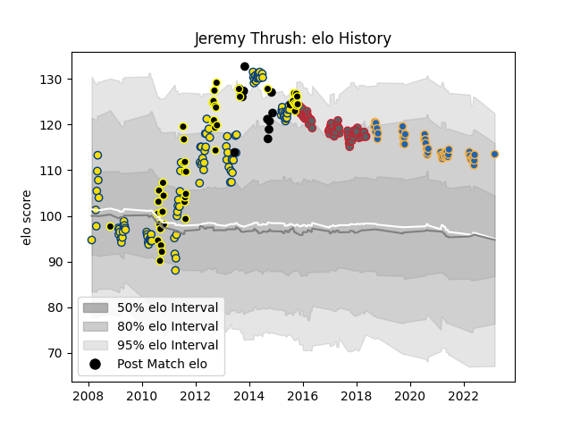

---  
layout: page  
title: Jeremy Thrush  
date: 2023-03-02 11:24:45.389430  
categories: player  
---
# Jeremy Thrush

## Positions: L

## Country: New Zealand

## Current elo: 114.0

## Current Percentile: 89.0

# Elo History

# Match History

| Team             |   Appearances |   Win Rate |
|:-----------------|--------------:|-----------:|
| Hurricanes       |           104 |   0.548077 |
| Gloucester Rugby |            58 |   0.543103 |
| Wellington       |            48 |   0.583333 |
| Western Force    |            45 |   0.4      |
| New Zealand      |            13 |   0.923077 |

| Opponent                 |   Matches |   Win Rate |
|:-------------------------|----------:|-----------:|
| Chiefs                   |        14 |   0.392857 |
| Crusaders                |        14 |   0.464286 |
| Blues                    |        13 |   0.461538 |
| Highlanders              |        12 |   0.5      |
| Brumbies                 |        12 |   0.25     |
| New South Wales Waratahs |        11 |   0.272727 |
| Queensland Reds          |        10 |   0.6      |
| Melbourne Rebels         |        10 |   0.5      |
| Cheetahs                 |         7 |   0.714286 |
| Stormers                 |         7 |   0.285714 |
| Bulls                    |         6 |   0.333333 |
| Harlequins               |         6 |   0.416667 |
| London Irish             |         5 |   0.8      |
| Sharks                   |         5 |   0.4      |
| Manawatu                 |         5 |   0.2      |
| Sale Sharks              |         5 |   0.8      |
| North Harbour            |         5 |   1        |
| Argentina                |         5 |   1        |
| Exeter Chiefs            |         5 |   0.4      |
| Western Force            |         5 |   1        |
| Canterbury               |         5 |   0.2      |
| Northampton Saints       |         4 |   0.25     |
| Otago                    |         4 |   0.75     |
| Southland                |         4 |   1        |
| Auckland                 |         4 |   0        |
| Hawke's Bay              |         4 |   0.5      |
| Waikato                  |         4 |   0.75     |
| Saracens                 |         4 |   0.5      |
| Lions                    |         4 |   1        |
| Bay of Plenty            |         4 |   0.5      |
| Newcastle Falcons        |         3 |   0.666667 |
| Worcester Warriors       |         3 |   0.666667 |
| Bath Rugby               |         3 |   0.333333 |
| Taranaki                 |         3 |   1        |
| Wasps                    |         3 |   0.333333 |
| Brisbane City            |         3 |   1        |
| La Rochelle              |         3 |   0.666667 |
| Canberra Vikings         |         3 |   0.666667 |
| Leicester Tigers         |         3 |   0        |
| Tasman                   |         2 |   0.5      |
| Queensland Country       |         2 |   0.5      |
| South Africa             |         2 |   0.5      |
| Zebre                    |         2 |   1        |
| Northland                |         2 |   1        |
| NSW Country Eagles       |         2 |   0.5      |
| Australia                |         2 |   1        |
| Melbourne Rising         |         2 |   1        |
| Hurricanes               |         2 |   0.5      |
| Fijian Drua              |         2 |   0.5      |
| Cardiff Blues            |         2 |   0.5      |
| Counties Manukau         |         2 |   0.5      |
| Connacht                 |         1 |   1        |
| Bayonne                  |         1 |   1        |
| Benetton Treviso         |         1 |   1        |
| Bristol Rugby            |         1 |   1        |
| United States of America |         1 |   1        |
| Stade Francais Paris     |         1 |   0        |
| Sydney Rays              |         1 |   1        |
| Pau                      |         1 |   0        |
| Southern Kings           |         1 |   1        |
| France                   |         1 |   1        |
| Scotland                 |         1 |   1        |
| Japan                    |         1 |   1        |
| Moana Pasifika           |         1 |   1        |
| Agen                     |         1 |   1        |