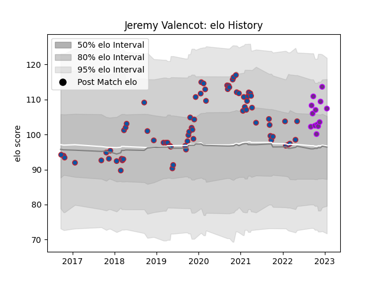

---  
layout: page  
title: Jeremy Valencot  
date: 2022-11-22 11:33:23.598347  
categories: player  
---
# Jeremy Valencot

## Positions: SH

## Current elo: 89.0

## Current Percentile: 18.0

# Elo History

# Match History

| Team        |   Appearances |   Win Rate |
|:------------|--------------:|-----------:|
| Grenoble    |            34 |   0.352941 |
| US Bressane |            10 |   0.8      |

| Opponent                   |   Matches |   Win Rate |
|:---------------------------|----------:|-----------:|
| Rouen                      |         3 |   0.333333 |
| Lyon                       |         3 |   0        |
| Agen                       |         2 |   0.5      |
| Castres Olympique          |         2 |   0        |
| Provence Rugby             |         2 |   1        |
| Perpignan                  |         2 |   0        |
| Nevers                     |         2 |   1        |
| Montauban                  |         2 |   0.5      |
| Dax                        |         2 |   0.5      |
| Mont-de-Marsan             |         2 |   0        |
| Carcassonne                |         2 |   0.5      |
| Beziers                    |         2 |   1        |
| Chambery                   |         1 |   1        |
| Nice                       |         1 |   1        |
| Stade Francais Paris       |         1 |   1        |
| Benetton Treviso           |         1 |   0        |
| Rennes                     |         1 |   1        |
| Biarritz Olympique         |         1 |   0        |
| Pau                        |         1 |   0        |
| Oyonnax                    |         1 |   0        |
| Newcastle Falcons          |         1 |   0        |
| Clermont Auvergne          |         1 |   0        |
| Blagnac                    |         1 |   1        |
| Narbonne                   |         1 |   0        |
| Montpellier Herault        |         1 |   0        |
| Bourgoin-Jallieu           |         1 |   1        |
| Aurillac                   |         1 |   0        |
| Carqueiranne-Hyères        |         1 |   1        |
| Cognac Saint Jean d'Angély |         1 |   1        |
| Suresnes                   |         1 |   1        |