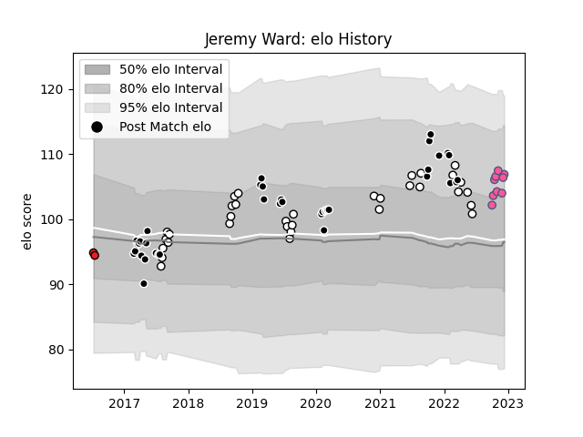

---  
layout: page  
title: Jeremy Ward  
date: 2022-12-14 11:33:03.166218  
categories: player  
---
# Jeremy Ward

## Positions: C

## Current elo: 107.0

## Current Percentile: 80.0

# Elo History

# Match History

| Team                 |   Appearances |   Win Rate |
|:---------------------|--------------:|-----------:|
| Sharks               |            38 |   0.578947 |
| Natal Sharks         |            33 |   0.727273 |
| Stade Francais Paris |             9 |   0.611111 |
| Southern Kings       |             2 |   0        |

| Opponent                 |   Matches |   Win Rate |
|:-------------------------|----------:|-----------:|
| Griquas                  |         7 |   0.857143 |
| Free State Cheetahs      |         7 |   0.571429 |
| Pumas                    |         6 |   0.833333 |
| Stormers                 |         6 |   0.416667 |
| Golden Lions             |         5 |   0.8      |
| Western Province         |         5 |   0.4      |
| Lions                    |         5 |   0.2      |
| Bulls                    |         4 |   0.5      |
| Jaguares                 |         4 |   0.75     |
| Blue Bulls               |         3 |   1        |
| Queensland Reds          |         2 |   0.5      |
| Southern Kings           |         2 |   0.5      |
| Melbourne Rebels         |         2 |   0.75     |
| Brumbies                 |         2 |   0.5      |
| Ospreys                  |         1 |   1        |
| Scarlets                 |         1 |   1        |
| Stade Toulousain         |         1 |   0.5      |
| Sunwolves                |         1 |   1        |
| Toulon                   |         1 |   0        |
| Western Force            |         1 |   1        |
| Perpignan                |         1 |   1        |
| Pau                      |         1 |   1        |
| Benetton Treviso         |         1 |   1        |
| New South Wales Waratahs |         1 |   1        |
| Munster                  |         1 |   0        |
| Montpellier Herault      |         1 |   0        |
| La Rochelle              |         1 |   1        |
| Hurricanes               |         1 |   0        |
| Highlanders              |         1 |   1        |
| Glasgow Warriors         |         1 |   0        |
| Cheetahs                 |         1 |   1        |
| Cardiff Blues            |         1 |   0        |
| Brive                    |         1 |   1        |
| Bordeaux Begles          |         1 |   0        |
| Blues                    |         1 |   1        |
| Zebre                    |         1 |   1        |