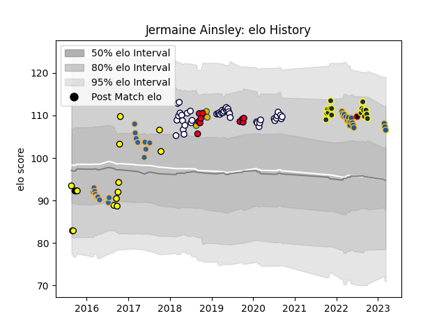

---  
layout: page  
title: Jermaine Ainsley  
date: 2023-03-02 11:26:33.458650  
categories: player  
---
# Jermaine Ainsley

## Positions: P

## Country: New Zealand Maori

## Current elo: 108.0

## Current Percentile: 87.0

# Elo History

# Match History

| Team              |   Appearances |   Win Rate |
|:------------------|--------------:|-----------:|
| Melbourne Rebels  |            43 |   0.453488 |
| Western Force     |            18 |   0.222222 |
| Otago             |            16 |   0.4375   |
| Perth Spirit      |            16 |   0.625    |
| Highlanders       |            15 |   0.266667 |
| Melbourne Rising  |            10 |   0.3      |
| Australia         |             3 |   0.333333 |
| New Zealand Maori |             1 |   1        |

| Opponent                 |   Matches |   Win Rate |
|:-------------------------|----------:|-----------:|
| Brumbies                 |        11 |   0.454545 |
| Queensland Reds          |        10 |   0.75     |
| New South Wales Waratahs |         9 |   0.111111 |
| Hurricanes               |         6 |   0        |
| NSW Country Eagles       |         6 |   0.333333 |
| Blues                    |         5 |   0.2      |
| Brisbane City            |         5 |   0.4      |
| Crusaders                |         5 |   0        |
| Highlanders              |         5 |   0.4      |
| Sunwolves                |         4 |   0.75     |
| Manawatu                 |         3 |   0.666667 |
| Taranaki                 |         3 |   0        |
| Stormers                 |         3 |   0        |
| Queensland Country       |         3 |   0.666667 |
| Melbourne Rebels         |         3 |   0.333333 |
| Western Force            |         3 |   1        |
| Fijian Drua              |         3 |   0.333333 |
| Chiefs                   |         3 |   0        |
| Sharks                   |         2 |   0.5      |
| Waikato                  |         2 |   0.5      |
| Lions                    |         2 |   0.5      |
| Bulls                    |         2 |   0        |
| Melbourne Rising         |         2 |   1        |
| Sydney Rays              |         2 |   1        |
| Canberra Vikings         |         2 |   0.5      |
| North Harbour Rays       |         2 |   0.5      |
| Canterbury               |         2 |   0.5      |
| Ireland                  |         1 |   1        |
| Tasman                   |         1 |   1        |
| Sydney Stars             |         1 |   0        |
| Southland                |         1 |   1        |
| Northland                |         1 |   1        |
| Counties Manukau         |         1 |   0        |
| Italy                    |         1 |   1        |
| New Zealand              |         1 |   0        |
| England                  |         1 |   0        |
| Moana Pasifika           |         1 |   1        |
| Greater Sydney Rams      |         1 |   1        |
| Bay of Plenty            |         1 |   0        |
| Jaguares                 |         1 |   0        |
| Auckland                 |         1 |   0        |