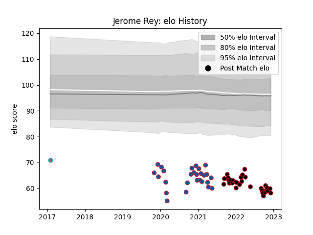

---  
layout: page  
title: Jerome Rey  
date: 2022-12-09 13:19:39.505208  
categories: player  
---
# Jerome Rey

## Positions: P

## Current elo: 58.0

## Current Percentile: 0.0

# Elo History

# Match History

| Team             |   Appearances |   Win Rate |
|:-----------------|--------------:|-----------:|
| Lyon             |            30 |   0.533333 |
| Grenoble         |            27 |   0.481481 |
| Bourgoin-Jallieu |             1 |   0        |

| Opponent             |   Matches |   Win Rate |
|:---------------------|----------:|-----------:|
| Biarritz Olympique   |         6 |   0.416667 |
| Montauban            |         3 |   0.166667 |
| Stade Toulousain     |         3 |   0.666667 |
| Stade Francais Paris |         3 |   0.666667 |
| Castres Olympique    |         3 |   0.666667 |
| Pau                  |         3 |   0.666667 |
| Oyonnax              |         3 |   0.666667 |
| Nevers               |         2 |   0.5      |
| Toulon               |         2 |   0        |
| Soyaux-Angouleme     |         2 |   0.5      |
| Rouen                |         2 |   1        |
| Racing 92            |         2 |   0.5      |
| Provence Rugby       |         2 |   0.5      |
| Perpignan            |         2 |   0        |
| Vannes               |         2 |   0        |
| Montpellier Herault  |         2 |   0.5      |
| Mont-de-Marsan       |         2 |   1        |
| La Rochelle          |         2 |   0        |
| Clermont Auvergne    |         2 |   0.5      |
| Brive                |         2 |   1        |
| Bordeaux Begles      |         2 |   0.5      |
| Aurillac             |         1 |   1        |
| Colomiers            |         1 |   0        |
| Carcassonne          |         1 |   1        |
| Beziers              |         1 |   1        |
| Bayonne              |         1 |   0        |
| Agen                 |         1 |   0        |