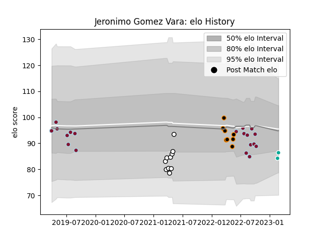

---  
layout: page  
title: Jeronimo Gomez Vara  
date: 2023-03-21 17:57:53.362397  
categories: player  
---
# Jeronimo Gomez Vara

Last updated: 2023-03-21
## Positions: FL, N8

## Current elo: 87.0

## Current Percentile: 17.0

# Elo History

# Match History

| Team                 |   Appearances |   Win Rate |
|:---------------------|--------------:|-----------:|
| Atlético del Rosario |            19 |   0.289474 |
| Olimpia Lions        |            10 |   0.5      |
| Jaguares XV          |             8 |   0.5      |
| Dallas Jackals       |             5 |   0        |

| Opponent            |   Matches |   Win Rate |
|:--------------------|----------:|-----------:|
| Penarol Rugby       |         4 |   0        |
| Selknam             |         4 |   0.25     |
| Cobras              |         4 |   1        |
| CASI                |         3 |   0.166667 |
| Cafeteros Pro       |         3 |   1        |
| SIC                 |         3 |   0        |
| San Luis            |         2 |   0.5      |
| Hindu               |         2 |   0        |
| Jaguares XV         |         2 |   0        |
| Pucara              |         2 |   0.25     |
| Alumni              |         1 |   0.5      |
| Seattle Seawolves   |         1 |   0        |
| San Diego Legion    |         1 |   0        |
| Regatas Bella Vista |         1 |   1        |
| Los Tilos           |         1 |   1        |
| Olimpia Lions       |         1 |   1        |
| Newman              |         1 |   0        |
| Belgrano            |         1 |   0        |
| Houston SaberCats   |         1 |   0        |
| Chicago Hounds      |         1 |   0        |
| CUBA                |         1 |   1        |
| Buenos Aires        |         1 |   0        |
| Utah Warriors       |         1 |   0        |