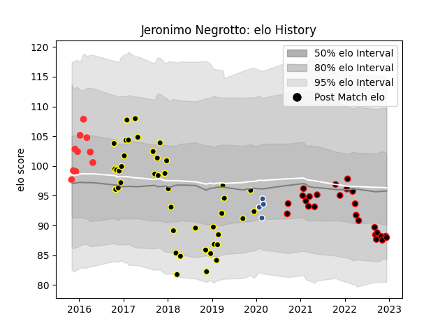

---  
layout: page  
title: Jeronimo Negrotto  
date: 2023-01-23 15:30:16.520175  
categories: player  
---
# Jeronimo Negrotto

## Positions: P

## Current elo: 77.0

## Current Percentile: 15.0

# Elo History

# Match History

| Team           |   Appearances |   Win Rate |
|:---------------|--------------:|-----------:|
| Mont-de-Marsan |            80 |   0.56875  |
| Nice           |            32 |   0.59375  |
| Tarbes         |            23 |   0.434783 |
| Agen           |             4 |   0.5      |

| Opponent                   |   Matches |   Win Rate |
|:---------------------------|----------:|-----------:|
| Colomiers                  |         8 |   0.5      |
| Biarritz Olympique         |         8 |   0.375    |
| Bourgoin-Jallieu           |         8 |   0.5      |
| Carcassonne                |         8 |   0.75     |
| Narbonne                   |         7 |   0.285714 |
| Bayonne                    |         7 |   0.642857 |
| Massy                      |         7 |   0.857143 |
| Albi                       |         7 |   0.5      |
| Vannes                     |         6 |   0.5      |
| Aurillac                   |         6 |   0.5      |
| Montauban                  |         5 |   0.8      |
| Dax                        |         5 |   0.6      |
| Soyaux-Angouleme           |         5 |   0.6      |
| Beziers                    |         5 |   0.4      |
| Tarbes                     |         4 |   0.875    |
| US Bressane                |         4 |   0.5      |
| Nevers                     |         4 |   0.5      |
| Oyonnax                    |         4 |   0.5      |
| Perpignan                  |         4 |   1        |
| Brive                      |         3 |   0.666667 |
| Grenoble                   |         3 |   0.333333 |
| Provence Rugby             |         3 |   0        |
| Chambery                   |         2 |   0        |
| Cognac Saint Jean d'Angély |         2 |   0.5      |
| Mont-de-Marsan             |         2 |   0.5      |
| Aubenas                    |         2 |   1        |
| Rennes                     |         1 |   1        |
| Suresnes                   |         1 |   1        |
| Rouen                      |         1 |   1        |
| Agen                       |         1 |   0        |
| Lyon                       |         1 |   0        |
| Clermont Auvergne          |         1 |   0        |
| Castres Olympique          |         1 |   0        |
| Carqueiranne-Hyères        |         1 |   1        |
| Blagnac                    |         1 |   1        |
| Dijon                      |         1 |   0        |