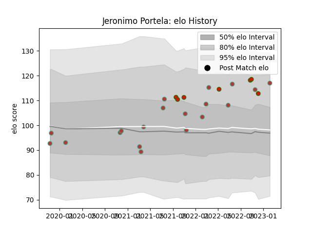

---  
layout: page  
title: Jeronimo Portela  
date: 2023-02-05 15:10:46.186219  
categories: player  
---
# Jeronimo Portela

## Positions: FH

## Country: Portugal

## Current elo: 117.0

## Current Percentile: 81.0

# Elo History

# Match History

| Team         |   Appearances |   Win Rate |
|:-------------|--------------:|-----------:|
| Portugal     |            19 |   0.578947 |
| Lusitanos XV |             7 |   0.714286 |

| Opponent                 |   Matches |   Win Rate |
|:-------------------------|----------:|-----------:|
| Georgia                  |         3 |   0.166667 |
| Brazil                   |         3 |   0.666667 |
| Castilla y Leon Iberians |         2 |   1        |
| Spain                    |         2 |   0.5      |
| Netherlands              |         2 |   1        |
| Belgium                  |         2 |   1        |
| Brussels Devils          |         2 |   1        |
| Chile                    |         1 |   1        |
| Delta                    |         1 |   1        |
| Black Lion               |         1 |   0        |
| Italy                    |         1 |   0        |
| Japan                    |         1 |   0        |
| Canada                   |         1 |   1        |
| Romania                  |         1 |   0        |
| Russia                   |         1 |   1        |
| Tel-Aviv Heat            |         1 |   0        |
| United States of America |         1 |   0.5      |