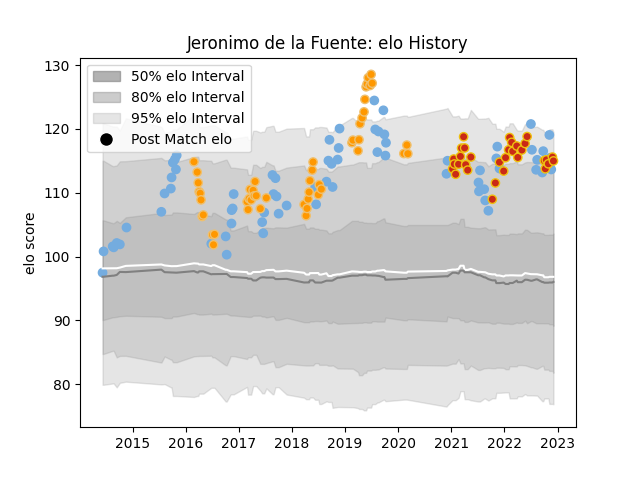

---  
layout: page  
title: Jeronimo de la Fuente  
date: 2022-12-09 13:05:08.940375  
categories: player  
---
# Jeronimo de la Fuente

## Positions: C

## Country: Argentina

## Current elo: 115.0

## Current Percentile: 91.0

# Elo History

# Match History

| Team      |   Appearances |   Win Rate |
|:----------|--------------:|-----------:|
| Argentina |            69 |   0.275362 |
| Jaguares  |            50 |   0.56     |
| Perpignan |            32 |   0.609375 |

| Opponent                 |   Matches |   Win Rate |
|:-------------------------|----------:|-----------:|
| South Africa             |        13 |   0.153846 |
| Australia                |        11 |   0.318182 |
| New Zealand              |        10 |   0        |
| Bulls                    |         7 |   0.714286 |
| Wales                    |         6 |   0.25     |
| Lions                    |         6 |   0.5      |
| Ireland                  |         6 |   0.166667 |
| Sharks                   |         6 |   0.5      |
| Scotland                 |         5 |   0.2      |
| England                  |         5 |   0.2      |
| France                   |         4 |   0        |
| Chiefs                   |         4 |   0.5      |
| Brumbies                 |         4 |   0.75     |
| Castres Olympique        |         3 |   0.333333 |
| Stormers                 |         3 |   0.333333 |
| Hurricanes               |         3 |   0.333333 |
| Clermont Auvergne        |         3 |   0.333333 |
| Crusaders                |         3 |   0        |
| Bordeaux Begles          |         2 |   1        |
| Queensland Reds          |         2 |   1        |
| Provence Rugby           |         2 |   1        |
| Biarritz Olympique       |         2 |   1        |
| Southern Kings           |         2 |   1        |
| Blues                    |         2 |   0.5      |
| New South Wales Waratahs |         2 |   1        |
| Stade Toulousain         |         2 |   0.5      |
| Georgia                  |         2 |   1        |
| Lyon                     |         2 |   0.5      |
| Cheetahs                 |         2 |   1        |
| Tonga                    |         2 |   1        |
| Italy                    |         2 |   1        |
| Highlanders              |         2 |   0        |
| Toulon                   |         1 |   0        |
| Stade Francais Paris     |         1 |   0        |
| Soyaux-Angouleme         |         1 |   1        |
| Vannes                   |         1 |   1        |
| United States of America |         1 |   1        |
| Sunwolves                |         1 |   0        |
| Aurillac                 |         1 |   0.5      |
| Romania                  |         1 |   1        |
| Racing 92                |         1 |   0        |
| Pau                      |         1 |   0        |
| Oyonnax                  |         1 |   1        |
| Nevers                   |         1 |   1        |
| Montpellier Herault      |         1 |   0        |
| Montauban                |         1 |   0        |
| Mont-de-Marsan           |         1 |   1        |
| La Rochelle              |         1 |   1        |
| Japan                    |         1 |   1        |
| Grenoble                 |         1 |   1        |
| Colomiers                |         1 |   1        |
| Brive                    |         1 |   1        |
| Melbourne Rebels         |         1 |   1        |