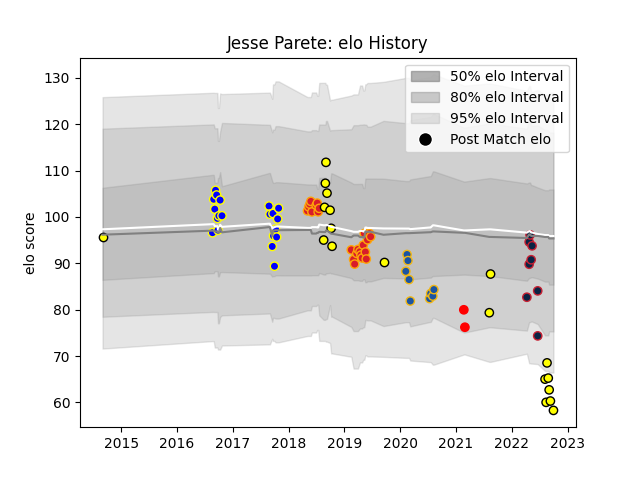

---  
layout: page  
title: Jesse Parete  
date: 2023-03-16 11:31:15.612506  
categories: player  
---
# Jesse Parete

## Positions: L, FL

## Current elo: 58.0

## Current Percentile: 2.0

# Elo History

# Match History

| Team                   |   Appearances |   Win Rate |
|:-----------------------|--------------:|-----------:|
| Chiefs                 |            24 |   0.520833 |
| Bay of Plenty          |            20 |   0.375    |
| Taranaki               |            19 |   0.315789 |
| Highlanders            |             9 |   0.222222 |
| New England Free Jacks |             8 |   0.75     |
| Yokohama Canon Eagles  |             2 |   0        |

| Opponent                        |   Matches |   Win Rate |
|:--------------------------------|----------:|-----------:|
| Wellington                      |         5 |   0        |
| Crusaders                       |         5 |   0.2      |
| Otago                           |         4 |   0.5      |
| Northland                       |         4 |   0.5      |
| Bay of Plenty                   |         4 |   0.25     |
| Hurricanes                      |         4 |   0.25     |
| Highlanders                     |         3 |   0.5      |
| Waikato                         |         3 |   0.333333 |
| Sharks                          |         3 |   0.333333 |
| Jaguares                        |         3 |   0.333333 |
| Auckland                        |         3 |   0        |
| Blues                           |         3 |   0.333333 |
| Counties Manukau                |         3 |   0.5      |
| Hawke's Bay                     |         2 |   1        |
| Canterbury                      |         2 |   0.5      |
| Taranaki                        |         2 |   0        |
| Southland                       |         2 |   0.5      |
| Brumbies                        |         2 |   1        |
| Rugby New York                  |         2 |   0.5      |
| Bulls                           |         2 |   0.5      |
| R.U. New York                   |         2 |   0.5      |
| North Harbour                   |         2 |   0        |
| Melbourne Rebels                |         2 |   0.5      |
| Manawatu                        |         2 |   1        |
| Old Glory DC                    |         1 |   1        |
| Queensland Reds                 |         1 |   1        |
| Chiefs                          |         1 |   1        |
| Rugby ATL                       |         1 |   1        |
| NTT Docomo Red Hurricanes Osaka |         1 |   0        |
| Seattle Seawolves               |         1 |   1        |
| Stormers                        |         1 |   1        |
| Sunwolves                       |         1 |   0        |
| Lions                           |         1 |   0        |
| Tasman                          |         1 |   0        |
| Utah Warriors                   |         1 |   1        |
| Kobelco Kobe Steelers           |         1 |   0        |
| New South Wales Waratahs        |         1 |   1        |