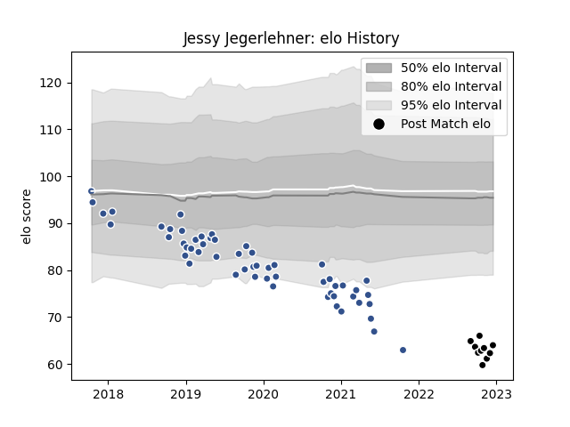

---  
layout: page  
title: Jessy Jegerlehner  
date: 2022-12-18 16:20:10.311411  
categories: player  
---
# Jessy Jegerlehner

## Positions: FL

## Current elo: 64.0

## Current Percentile: 0.0

# Elo History

# Match History

| Team           |   Appearances |   Win Rate |
|:---------------|--------------:|-----------:|
| Agen           |            55 |   0.172727 |
| Provence Rugby |            10 |   0.55     |

| Opponent             |   Matches |   Win Rate |
|:---------------------|----------:|-----------:|
| Clermont Auvergne    |         5 |   0        |
| Pau                  |         4 |   0        |
| Bordeaux Begles      |         4 |   0        |
| Toulon               |         4 |   0.25     |
| Lyon                 |         4 |   0.25     |
| Grenoble             |         4 |   0.75     |
| La Rochelle          |         3 |   0.333333 |
| Racing 92            |         3 |   0.166667 |
| Brive                |         3 |   0.333333 |
| Castres Olympique    |         3 |   0        |
| Bayonne              |         3 |   0.333333 |
| Stade Francais Paris |         2 |   0        |
| Stade Toulousain     |         2 |   0        |
| Zebre                |         2 |   0.5      |
| Harlequins           |         2 |   0        |
| Edinburgh            |         2 |   0        |
| Vannes               |         2 |   0        |
| Gloucester Rugby     |         2 |   0        |
| Oyonnax              |         1 |   0.5      |
| Wasps                |         1 |   0        |
| Aurillac             |         1 |   0        |
| Nevers               |         1 |   0        |
| Montauban            |         1 |   1        |
| Mont-de-Marsan       |         1 |   1        |
| Massy                |         1 |   0        |
| Carcassonne          |         1 |   1        |
| Beziers              |         1 |   1        |
| Benetton Treviso     |         1 |   1        |
| London Irish         |         1 |   0        |