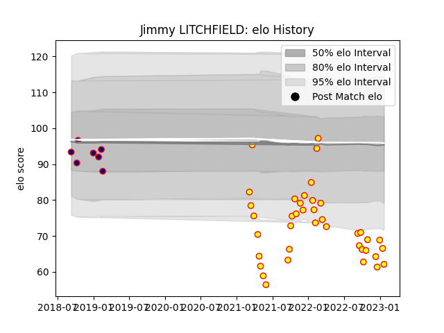

---  
layout: page  
title: Jimmy LITCHFIELD  
date: 2023-03-12 11:33:47.412292  
categories: player  
---
# Jimmy LITCHFIELD

## Positions: P

## Current elo: 47.0

## Current Percentile: 1.0

# Elo History

# Match History

| Team            |   Appearances |   Win Rate |
|:----------------|--------------:|-----------:|
| Richmond        |            42 |   0.285714 |
| London Scottish |             7 |   0.285714 |

| Opponent            |   Matches |   Win Rate |
|:--------------------|----------:|-----------:|
| Ealing Trailfinders |         7 |   0        |
| Bedford             |         5 |   0.6      |
| Cornish Pirates     |         5 |   0.1      |
| Hartpury College    |         5 |   0.4      |
| Nottingham          |         5 |   0.6      |
| Coventry            |         4 |   0        |
| Doncaster           |         4 |   0        |
| Jersey              |         4 |   0.5      |
| Ampthill            |         3 |   0.166667 |
| London Scottish     |         3 |   1        |
| Caldy               |         2 |   0        |
| London Irish        |         1 |   0        |
| Saracens            |         1 |   0        |