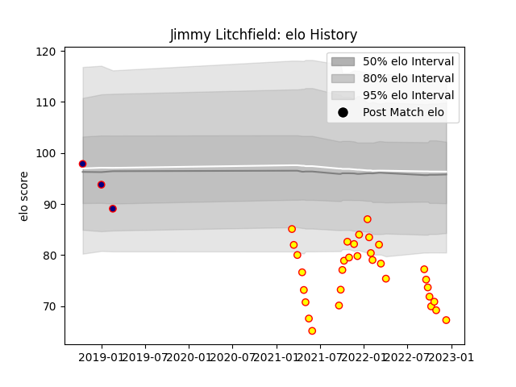

---  
layout: page  
title: Jimmy Litchfield  
date: 2022-12-14 11:18:10.398775  
categories: player  
---
# Jimmy Litchfield

## Positions: P

## Current elo: 67.0

## Current Percentile: 1.0

# Elo History

# Match History

| Team            |   Appearances |   Win Rate |
|:----------------|--------------:|-----------:|
| Richmond        |            32 |     0.3125 |
| London Scottish |             3 |     0      |

| Opponent            |   Matches |   Win Rate |
|:--------------------|----------:|-----------:|
| Bedford             |         5 |       0.6  |
| Cornish Pirates     |         5 |       0.1  |
| Ealing Trailfinders |         4 |       0    |
| Hartpury College    |         4 |       0.5  |
| Nottingham          |         4 |       0.5  |
| Coventry            |         3 |       0    |
| Ampthill            |         2 |       0.25 |
| Doncaster           |         2 |       0    |
| Jersey              |         2 |       0    |
| London Scottish     |         2 |       1    |
| Caldy               |         1 |       0    |
| Saracens            |         1 |       0    |