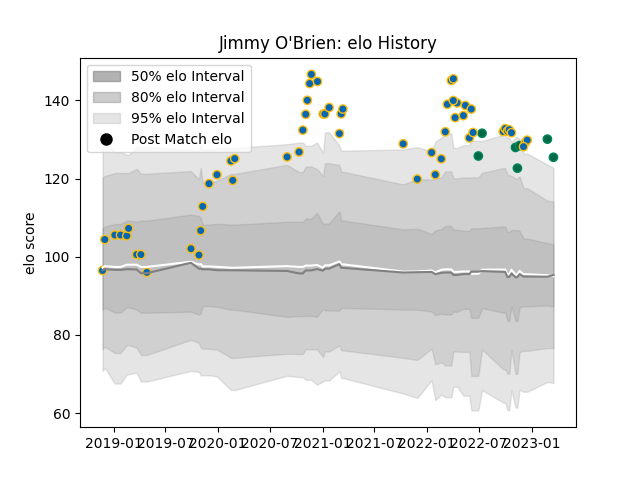

---  
layout: page  
title: Jimmy O'Brien  
date: 2022-12-09 13:21:28.959628  
categories: player  
---
# Jimmy O'Brien

## Positions: FB, C

## Country: Ireland

## Current elo: 111.0

## Current Percentile: 89.0

# Elo History

# Match History

| Team     |   Appearances |   Win Rate |
|:---------|--------------:|-----------:|
| Leinster |            47 |   0.840426 |
| Ireland  |             5 |   0.8      |

| Opponent          |   Matches |   Win Rate |
|:------------------|----------:|-----------:|
| Ulster            |         9 |   0.666667 |
| Glasgow Warriors  |         5 |   1        |
| Benetton Treviso  |         5 |   0.9      |
| Zebre             |         5 |   1        |
| Connacht          |         4 |   0.75     |
| Munster           |         4 |   1        |
| Ospreys           |         4 |   1        |
| Dragons           |         2 |   1        |
| Edinburgh         |         2 |   0.5      |
| Cardiff Blues     |         2 |   0.5      |
| New Zealand Maori |         2 |   0.5      |
| Cheetahs          |         1 |   1        |
| Fiji              |         1 |   1        |
| Scarlets          |         1 |   1        |
| Sharks            |         1 |   1        |
| South Africa      |         1 |   1        |
| Southern Kings    |         1 |   1        |
| Bulls             |         1 |   0        |
| Australia         |         1 |   1        |