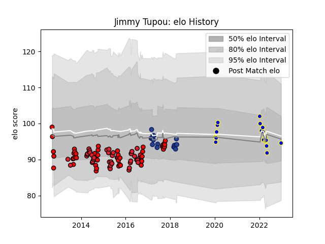

---  
layout: page  
title: Jimmy Tupou  
date: 2022-12-28 12:57:08.536221  
categories: player  
---
# Jimmy Tupou

## Positions: L, FL

## Current elo: 95.0

## Current Percentile: 33.0

# Elo History

# Match History

| Team             |   Appearances |   Win Rate |
|:-----------------|--------------:|-----------:|
| Counties Manukau |            50 |   0.56     |
| Crusaders        |            37 |   0.648649 |
| Urayasu D-Rocks  |            18 |   0.444444 |
| Blues            |            16 |   0.4375   |

| Opponent                          |   Matches |   Win Rate |
|:----------------------------------|----------:|-----------:|
| Chiefs                            |         8 |   0.125    |
| Waikato                           |         6 |   0.5      |
| Tasman                            |         6 |   0.5      |
| Highlanders                       |         6 |   0.333333 |
| Taranaki                          |         5 |   0.3      |
| Hawke's Bay                       |         5 |   0.6      |
| Sharks                            |         5 |   0.6      |
| Hurricanes                        |         5 |   0.4      |
| Bay of Plenty                     |         4 |   0.625    |
| Manawatu                          |         4 |   0.75     |
| Lions                             |         4 |   0.75     |
| Auckland                          |         4 |   0.5      |
| Blues                             |         4 |   1        |
| Queensland Reds                   |         3 |   1        |
| Canterbury                        |         3 |   0.333333 |
| Western Force                     |         3 |   1        |
| Kubota Spears Funabashi Tokyo-Bay |         3 |   0        |
| Wellington                        |         3 |   0.333333 |
| New South Wales Waratahs          |         3 |   0.333333 |
| North Harbour                     |         3 |   0.333333 |
| Otago                             |         3 |   1        |
| Southland                         |         2 |   1        |
| Kobelco Kobe Steelers             |         2 |   0.5      |
| Bulls                             |         2 |   0.5      |
| Melbourne Rebels                  |         2 |   1        |
| Saitama Wild Knights              |         2 |   0        |
| Northland                         |         2 |   1        |
| Stormers                          |         1 |   0        |
| Tokyo Sungoliath                  |         1 |   0        |
| Toshiba Brave Lupus Tokyo         |         1 |   1        |
| Southern Kings                    |         1 |   1        |
| Toyota Verblitz                   |         1 |   0        |
| Sunwolves                         |         1 |   1        |
| Munakata Sanix Blues              |         1 |   1        |
| Shizuoka Blue Revs                |         1 |   0        |
| Shimizu Blue Sharks               |         1 |   1        |
| Mie Honda Heat                    |         1 |   1        |
| Jaguares                          |         1 |   1        |
| Hino Red Dolphins                 |         1 |   1        |
| Green Rockets Tokatsu             |         1 |   1        |
| Crusaders                         |         1 |   0        |
| Cheetahs                          |         1 |   1        |
| Brumbies                          |         1 |   1        |
| British and Irish Lions           |         1 |   1        |
| Black Rams Tokyo                  |         1 |   1        |
| Yokohama Canon Eagles             |         1 |   0        |