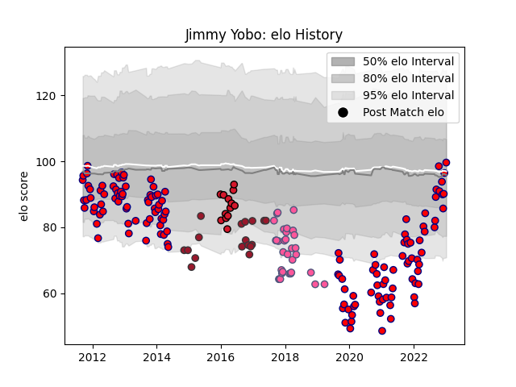

---  
layout: page  
title: Jimmy Yobo  
date: 2022-12-14 11:32:40.626540  
categories: player  
---
# Jimmy Yobo

## Positions: C, W

## Current elo: 77.0

## Current Percentile: 3.0

# Elo History

# Match History

| Team                 |   Appearances |   Win Rate |
|:---------------------|--------------:|-----------:|
| Aurillac             |           111 |   0.513514 |
| Stade Francais Paris |            32 |   0.3125   |
| Toulon               |            17 |   0.558824 |
| Oyonnax              |            13 |   0.230769 |

| Opponent                   |   Matches |   Win Rate |
|:---------------------------|----------:|-----------:|
| Pau                        |         9 |   0.333333 |
| Beziers                    |         9 |   0.444444 |
| La Rochelle                |         9 |   0.5      |
| Provence Rugby             |         8 |   0.6875   |
| Lyon                       |         8 |   0.375    |
| Agen                       |         7 |   0.428571 |
| Mont-de-Marsan             |         7 |   0.142857 |
| Oyonnax                    |         6 |   0.5      |
| Grenoble                   |         6 |   0.166667 |
| Colomiers                  |         5 |   0.8      |
| Montpellier Herault        |         5 |   0.4      |
| Albi                       |         5 |   0.3      |
| Montauban                  |         5 |   0.6      |
| Vannes                     |         5 |   0.6      |
| Brive                      |         5 |   0.4      |
| Castres Olympique          |         5 |   0.2      |
| Carcassonne                |         5 |   0.6      |
| Rouen                      |         4 |   0.5      |
| Nevers                     |         4 |   0.75     |
| Narbonne                   |         4 |   0.75     |
| Dax                        |         4 |   0.5      |
| Clermont Auvergne          |         4 |   0.25     |
| Racing 92                  |         3 |   0.333333 |
| US Bressane                |         3 |   0.666667 |
| Toulon                     |         3 |   0        |
| Stade Toulousain           |         3 |   0        |
| Biarritz Olympique         |         3 |   0.333333 |
| Soyaux-Angouleme           |         3 |   0.666667 |
| Bourgoin-Jallieu           |         2 |   0.5      |
| Tarbes                     |         2 |   0.5      |
| Massy                      |         2 |   1        |
| Auch                       |         2 |   1        |
| Perpignan                  |         2 |   0        |
| Edinburgh                  |         2 |   0.5      |
| Krasny Yar                 |         2 |   0.5      |
| London Irish               |         2 |   0.5      |
| Bordeaux Begles            |         2 |   0.5      |
| Bayonne                    |         2 |   0.5      |
| Périgueux                  |         1 |   1        |
| Roval Drome XV             |         1 |   0        |
| Scarlets                   |         1 |   1        |
| Stade Francais Paris       |         1 |   1        |
| Ospreys                    |         1 |   0        |
| Valence Romans Drome Rugby |         1 |   1        |