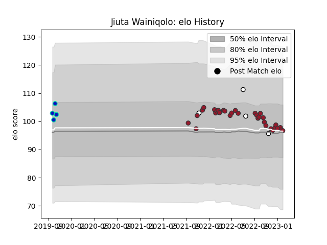

---  
layout: page  
title: Jiuta Wainiqolo  
date: 2023-01-06 00:17:32.117546  
categories: player  
---
# Jiuta Wainiqolo

## Positions: W

## Country: Fiji

## Current elo: 106.0

## Current Percentile: 66.0

# Elo History

# Match History

| Team        |   Appearances |   Win Rate |
|:------------|--------------:|-----------:|
| Toulon      |            29 |   0.568966 |
| Fiji        |             4 |   0.5      |
| Fijian Drua |             4 |   0.75     |

| Opponent             |   Matches |   Win Rate |
|:---------------------|----------:|-----------:|
| Bordeaux Begles      |         3 |   0.666667 |
| Stade Toulousain     |         3 |   0.333333 |
| La Rochelle          |         3 |   0.333333 |
| Pau                  |         3 |   0.833333 |
| Racing 92            |         2 |   0        |
| Stade Francais Paris |         2 |   0.5      |
| Castres Olympique    |         2 |   0.5      |
| Clermont Auvergne    |         2 |   1        |
| Lyon                 |         2 |   1        |
| Bayonne              |         2 |   0.5      |
| Perpignan            |         2 |   0.5      |
| Bath Rugby           |         1 |   1        |
| Sydney Rays          |         1 |   1        |
| Spain                |         1 |   1        |
| Samoa                |         1 |   0        |
| Melbourne Rising     |         1 |   1        |
| Queensland Country   |         1 |   1        |
| Ireland              |         1 |   0        |
| Canberra Vikings     |         1 |   0        |
| Brive                |         1 |   0        |
| Biarritz Olympique   |         1 |   1        |
| Tonga                |         1 |   1        |