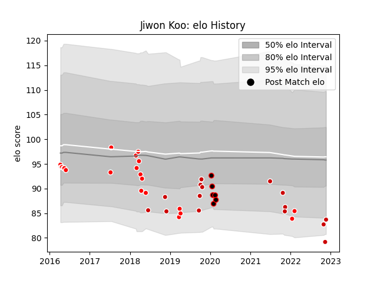

---  
layout: page  
title: Jiwon Koo  
date: 2023-03-17 17:20:39.892108  
categories: player  
---
# Jiwon Koo

## Positions: P

## Country: Japan

## Current elo: 81.0

## Current Percentile: 6.0

# Elo History

# Match History

| Team                  |   Appearances |   Win Rate |
|:----------------------|--------------:|-----------:|
| Sunwolves             |            19 |   0.184211 |
| Japan                 |            15 |   0.4      |
| Mie Honda Heat        |            14 |   0.357143 |
| Kobelco Kobe Steelers |             5 |   0.4      |

| Opponent                          |   Matches |   Win Rate |
|:----------------------------------|----------:|-----------:|
| Melbourne Rebels                  |         3 |   0        |
| Kubota Spears Funabashi Tokyo-Bay |         3 |   0.333333 |
| Urayasu D-Rocks                   |         3 |   0        |
| Stormers                          |         3 |   0.166667 |
| Yokohama Canon Eagles             |         3 |   0.666667 |
| Brumbies                          |         2 |   0        |
| Munakata Sanix Blues              |         2 |   0.5      |
| Russia                            |         2 |   1        |
| England                           |         2 |   0        |
| Blues                             |         2 |   0.5      |
| Green Rockets Tokatsu             |         2 |   1        |
| Ireland                           |         2 |   0.5      |
| Toyota Verblitz                   |         2 |   0        |
| Lions                             |         2 |   0        |
| New South Wales Waratahs          |         2 |   0.5      |
| South Africa                      |         1 |   0        |
| British and Irish Lions           |         1 |   0        |
| Cheetahs                          |         1 |   0        |
| Tokyo Sungoliath                  |         1 |   0        |
| Samoa                             |         1 |   1        |
| Toshiba Brave Lupus Tokyo         |         1 |   0        |
| Western Force                     |         1 |   0        |
| Scotland                          |         1 |   1        |
| New Zealand                       |         1 |   0        |
| Saitama Wild Knights              |         1 |   0        |
| Portugal                          |         1 |   1        |
| Chiefs                            |         1 |   0        |
| Black Rams Tokyo                  |         1 |   1        |
| Jaguares                          |         1 |   1        |
| Italy                             |         1 |   0        |
| France                            |         1 |   0        |
| Crusaders                         |         1 |   0        |
| Australia                         |         1 |   0        |