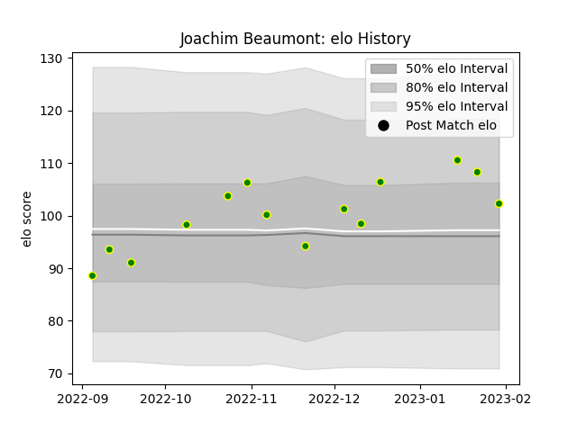

---  
layout: page  
title: Joachim Beaumont  
date: 2023-02-02 18:56:59.344708  
categories: player  
---
# Joachim Beaumont

## Positions: FL

## Current elo: 102.0

## Current Percentile: 78.0

# Elo History

# Match History

| Team                |   Appearances |   Win Rate |
|:--------------------|--------------:|-----------:|
| Carqueiranne-Hyères |            14 |   0.357143 |

| Opponent                   |   Matches |   Win Rate |
|:---------------------------|----------:|-----------:|
| Albi                       |         2 |        0.5 |
| Bourgoin-Jallieu           |         2 |        0   |
| Suresnes                   |         2 |        0.5 |
| Blagnac                    |         1 |        0   |
| Chambery                   |         1 |        1   |
| Cognac Saint Jean d'Angély |         1 |        1   |
| Narbonne                   |         1 |        0   |
| Nice                       |         1 |        0   |
| Rennes                     |         1 |        0   |
| Tarbes                     |         1 |        1   |
| Valence Romans Drome Rugby |         1 |        0   |