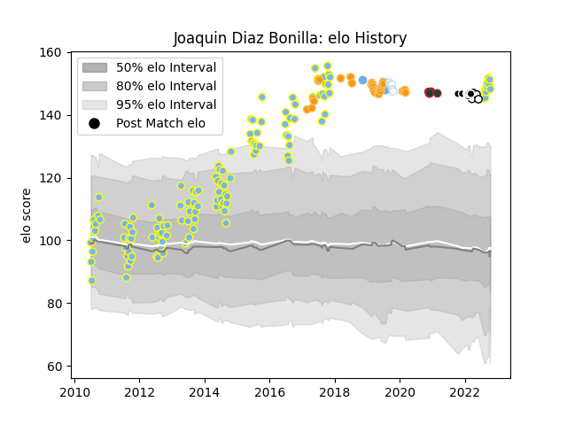

---  
layout: page  
title: Joaquin Diaz Bonilla  
date: 2023-03-17 17:23:47.403904  
categories: player  
---
# Joaquin Diaz Bonilla

## Positions: FH

## Country: Argentina

## Current elo: 148.0

## Current Percentile: 99.0

# Elo History

# Match History

| Team             |   Appearances |   Win Rate |
|:-----------------|--------------:|-----------:|
| Hindu            |           125 |   0.832    |
| Jaguares         |            29 |   0.586207 |
| Sharks           |             9 |   0.611111 |
| Racing 92        |             6 |   0.25     |
| Leicester Tigers |             5 |   0.4      |
| Argentina        |             4 |   0        |
| Natal Sharks     |             4 |   0.25     |

| Opponent                  |   Matches |   Win Rate |
|:--------------------------|----------:|-----------:|
| Belgrano                  |        12 |   0.75     |
| Newman                    |        11 |   0.727273 |
| CASI                      |        10 |   0.7      |
| Pucara                    |        10 |   1        |
| CUBA                      |        10 |   0.8      |
| Atlético del Rosario      |         9 |   0.833333 |
| La Plata                  |         9 |   0.722222 |
| Alumni                    |         8 |   0.875    |
| San Luis                  |         7 |   0.714286 |
| Stormers                  |         7 |   0.357143 |
| SIC                       |         7 |   0.857143 |
| Lomas                     |         6 |   0.833333 |
| Lions                     |         5 |   0.4      |
| Bulls                     |         4 |   1        |
| Regatas Bella Vista       |         4 |   1        |
| San Martin                |         3 |   0.666667 |
| Manuel Belgrano           |         3 |   1        |
| Sharks                    |         3 |   0.333333 |
| New South Wales Waratahs  |         3 |   1        |
| Free State Cheetahs       |         2 |   0        |
| Champagnat                |         2 |   1        |
| Los Tilos                 |         2 |   1        |
| Chiefs                    |         2 |   0.5      |
| Pueyrredón                |         2 |   1        |
| Southern Kings            |         2 |   0.5      |
| Olivos                    |         2 |   1        |
| Melbourne Rebels          |         1 |   1        |
| Sunwolves                 |         1 |   1        |
| New Zealand               |         1 |   0        |
| Universitario de La Plata |         1 |   1        |
| Toulon                    |         1 |   0        |
| Stade Toulousain          |         1 |   0        |
| Pau                       |         1 |   1        |
| San Andres                |         1 |   1        |
| Scarlets                  |         1 |   1        |
| South Africa              |         1 |   0        |
| San Albano                |         1 |   1        |
| Queensland Reds           |         1 |   1        |
| Agen                      |         1 |   0.5      |
| Mariano Moreno            |         1 |   1        |
| Lyon                      |         1 |   0        |
| Australia                 |         1 |   0        |
| Benetton Treviso          |         1 |   1        |
| Blues                     |         1 |   1        |
| Bristol Rugby             |         1 |   0        |
| Brive                     |         1 |   1        |
| Brumbies                  |         1 |   1        |
| Buenos Aires              |         1 |   1        |
| Cardiff Blues             |         1 |   0        |
| Crusaders                 |         1 |   0        |
| Delta                     |         1 |   1        |
| Deportiva Francesa        |         1 |   1        |
| Exeter Chiefs             |         1 |   0        |
| Gloucester Rugby          |         1 |   1        |
| Golden Lions              |         1 |   0        |
| Griquas                   |         1 |   1        |
| Highlanders               |         1 |   0        |
| Hurricanes                |         1 |   1        |
| Ireland                   |         1 |   0        |
| La Rochelle               |         1 |   0        |
| Liceo Naval               |         1 |   1        |
| London Irish              |         1 |   0        |
| Western Force             |         1 |   0        |